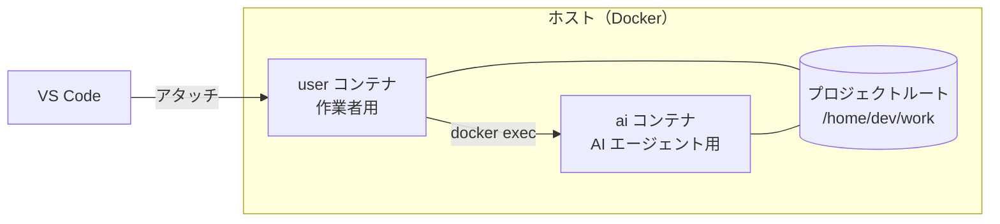

# devcontainer-env-core

プロジェクトに組み込んで使う、Dev Container の開発環境一式です。

- **2つのコンテナで権限を分離:** 作業者用の `user` コンテナと、AI エージェント用の `ai` コンテナを分け、AI エージェントには sudo・Docker ソケット・クラウドの認証情報を渡しません。
- **検証済みのツールだけを導入:** CLI ツールや言語ランタイムは [mise](https://mise.jdx.dev/) の lockfile でバージョンとチェックサムを固定してインストールします。
- **VS Code の拡張機能を許可リストで管理:** Dev Container Feature として、共通設定と拡張機能の許可リスト（`extensions.allowed`）を提供します。

## 目次

- [構成](#構成)
- [同梱ツール](#同梱ツール)
- [必要なもの](#必要なもの)
- [使い方](#使い方)
- [VS Code の Feature](#vs-code-の-feature)
- [ツールの追加・バージョンの上書き](#ツールの追加バージョンの上書き)
- [設定項目](#設定項目)
- [ビルドキャッシュ](#ビルドキャッシュ)
- [注意事項](#注意事項)
- [ライセンス](#ライセンス)

## 構成

プロジェクトの `.devcontainer/devcontainer-env-core` に配置すると、プロジェクトルートが両方のコンテナの `/home/dev/work` にマウントされます。



| | `user` コンテナ | `ai` コンテナ |
| --- | --- | --- |
| 用途 | 作業者が使う。VS Code がアタッチする | AI エージェント（Claude Code / Codex など）を動かす |
| ワークスペース（プロジェクトルート） | 読み書き可 | 読み書き可 |
| sudo | あり（パスワード必須） | なし |
| Docker ソケット | あり（`ai` コンテナを操作するため） | なし |
| ワークスペースの `mise.toml` | `mise trust` するまで読み込まない | そのまま読み込む |

## 同梱ツール

バージョンは各設定ファイルで固定され、定期的に更新されます。

**共通（`user` / `ai`）** — [docker-images/dev-base/etc/mise/config.toml](docker-images/dev-base/etc/mise/config.toml)

| 分類 | ツール |
| --- | --- |
| 言語 | Python、Node.js（LTS のバージョンのみ） |
| Python パッケージ | uv、ipykernel、pandas、pyarrow |
| 汎用 | git、curl、wget、jq、yq、GitHub CLI（gh）、tmux、build-essential |
| Lint | hadolint、secretlint |
| Terraform | tfenv、tflint、terraform-docs |
| クラウド | AWS CLI、Google Cloud CLI |

**`ai` コンテナ** — [docker-images/ai/opt/mise/config.toml](docker-images/ai/opt/mise/config.toml)

Claude Code、OpenAI Codex CLI、GitHub Copilot CLI、GitHub Copilot Language Server、Amazon Kiro CLI、Google Antigravity CLI

**`user` コンテナ** — [docker-images/user/opt/mise/config.toml](docker-images/user/opt/mise/config.toml)

Docker CLI、Renovate CLI、sudo

## 必要なもの

- Docker（Docker Desktop for Mac、または WSL2 上の Docker）
- [VS Code](https://code.visualstudio.com/) と [Dev Containers 拡張機能](https://marketplace.visualstudio.com/items?itemName=ms-vscode-remote.remote-containers)

## 使い方

### 1. プロジェクトに配置する

プロジェクトの `.devcontainer/devcontainer-env-core` に配置します。Git のサブモジュールとして追加すると、使うバージョン（コミット）を固定できます。

```sh
git submodule add https://github.com/Diiva-Szk/devcontainer-env-core.git .devcontainer/devcontainer-env-core
```

### 2. `.env` を生成する

ホスト側で次のスクリプトを実行します。Docker ソケットのグループ ID などを検出し、`compose.yml` と同じディレクトリに `.env` を書き出します。

```sh
bash .devcontainer/devcontainer-env-core/setup-docker-env.sh
```

`sudo` のパスワードなども `.env` で変更できます（[設定項目](#設定項目)）。

### 3. `devcontainer.json` を作成する

`.devcontainer/devcontainer.json` を作成します。

```jsonc
{
  "name": "my-project",
  "dockerComposeFile": "devcontainer-env-core/compose.yml",
  "service": "user",
  "runServices": ["user", "ai"],
  "workspaceFolder": "/home/dev/work",
  "remoteUser": "dev",
  "features": {
    // 共通設定と拡張機能の許可リスト（他の vscode-* Feature を使う場合も必須）
    "ghcr.io/diiva-szk/devcontainer-env-core/vscode-common:1": {},
    // 必要に応じて追加
    "ghcr.io/diiva-szk/devcontainer-env-core/vscode-python:1": {},
    "ghcr.io/diiva-szk/devcontainer-env-core/vscode-terraform:1": {}
  }
}
```

プロジェクトのディレクトリ構成は次のようになります。

```text
my-project/
├── .devcontainer/
│   ├── devcontainer.json
│   └── devcontainer-env-core/   # このリポジトリ
│       ├── compose.yml
│       └── .env                 # 手順 2 で生成
└── ...
```

### 4. コンテナを開く

VS Code でプロジェクトを開き、コマンドパレットから **Dev Containers: Reopen in Container** を実行します。

初回はイメージをビルドします。このリポジトリの CI が `main` のビルドキャッシュを公開しているため、内容が同じ層はダウンロードで済み、変更のあった層だけがローカルでビルドされます（[ビルドキャッシュ](#ビルドキャッシュ)）。

### 5. AI エージェントを使う

`user` コンテナのターミナルで `ai` コマンドを実行すると、このプロジェクトの `ai` コンテナに入れます。どのディレクトリからでも実行でき、**`ai` コンテナでも同じディレクトリで起動します**（例: `~/work/src` で実行すると、`ai` コンテナの `~/work/src` で起動します）。

```sh
ai               # ai コンテナで bash を起動する
ai claude        # ai コンテナで直接 Claude Code を起動する（引数はそのまま渡る）

# ai コンテナ内で
claude     # Claude Code
codex      # OpenAI Codex CLI
copilot    # GitHub Copilot CLI
kiro-cli   # Amazon Kiro CLI
agy        # Google Antigravity CLI
```

- 各ツールのログイン（認証）は、初回に `ai` コンテナ内で行ってください。
- `ai` コンテナと共有していないディレクトリ（`~` など）で実行した場合は、`ai` コンテナの `~/work` で起動します。
## VS Code の Feature

| Feature | 内容 |
| --- | --- |
| `ghcr.io/diiva-szk/devcontainer-env-core/vscode-common` | 共通の VS Code 設定と拡張機能（日本語化、Git、Markdown、CSV、Jupyter など）、および全 Feature の拡張機能の許可リスト（`extensions.allowed`） |
| `ghcr.io/diiva-szk/devcontainer-env-core/vscode-python` | Python 開発用の拡張機能 |
| `ghcr.io/diiva-szk/devcontainer-env-core/vscode-terraform` | Terraform 開発用の拡張機能 |

- 許可リストにない拡張機能は VS Code にインストールできません。`vscode-python` / `vscode-terraform` を使う場合も、許可リストを提供する `vscode-common` を必ず併用してください。
- `:1` と指定すると、メジャーバージョン 1 の最新版が使われます。

## ツールの追加・バージョンの上書き

プロジェクトルートに `mise.toml` を置くと、イメージに入っているツールより優先されます。イメージに無いツールの追加もできます。

例: プロジェクトでは Node.js 22 を使う場合

```toml
# <プロジェクトルート>/mise.toml
[tools]
node = "22"
```

| カレントディレクトリ | 使われる Node.js |
| --- | --- |
| プロジェクトルート（`~/work`）とその配下 | 22（プロジェクトの `mise.toml`） |
| プロジェクト外（`~` など） | イメージのバージョン |

- **ファイル名は `mise.toml`** にしてください。`.mise.toml`、`.config/mise.toml`、`mise/config.toml` も使えますが、プロジェクト直下の `config.toml` は認識されません。
- イメージに入っていないバージョンは、初めてコマンドを実行したときに自動でインストールされます（明示的に入れる場合は `mise install`）。
- チェックサムを固定したい場合は、プロジェクトで `mise lock` を実行し、`mise.lock` もコミットしてください。

### `user` コンテナでは `mise trust` が必要

`user` コンテナは、ワークスペースの `mise.toml` を **`mise trust` するまで読み込みません**。trust するまでは、その配下で mise のツール（`node`、`python` など）が使えません。

ワークスペースは `ai` コンテナと共有しているため、AI エージェントが `mise.toml` を書き換える可能性があります。sudo と Docker ソケットを持つ `user` コンテナで、確認していない設定が黙って読み込まれないようにしています。

```sh
mise trust --show     # 内容を確認する
mise trust mise.toml  # 確認してから trust する
```

- trust はファイルの内容に紐づくため、`mise.toml` を編集すると再度 trust が必要です。
- trust の記録はコンテナ内にあるため、コンテナを作り直すと再度 trust が必要です。
- `ai` コンテナでは trust は不要です。

### 別の Node.js を指定したときの注意

プロジェクトで別の Node.js を指定したディレクトリでは、次のコマンドがそのままでは使えなくなります。

イメージの Node.js のバージョンは [docker-images/dev-base/etc/mise/config.toml](docker-images/dev-base/etc/mise/config.toml) の `core:node` で確認できます（以下では `<イメージの版>` と表記します）。

- **イメージの Node.js に `npm install -g` したコマンド:** `No version is set for shim` エラーになります。イメージと同じバージョンも併せて指定すると使えます（先頭のバージョンが優先されます）。

  ```toml
  [tools]
  node = ["22", "<イメージの版>"]
  ```

- **`user` コンテナの `renovate`:** Renovate CLI はイメージの Node.js を前提にしています。そのディレクトリで有効な Node.js（上の例では先頭の 22）で起動すると失敗するため、イメージの Node.js を明示して実行してください。

  ```sh
  mise exec node@<イメージの版> -- renovate --version
  ```

## 設定項目

`.devcontainer/devcontainer-env-core/.env` に書くと、イメージのビルドとコンテナの起動に反映されます。変更後はコンテナをリビルドしてください（**Dev Containers: Rebuild Container**）。

| 変数 | 既定値 | 内容 |
| --- | --- | --- |
| `USER_PASS` | `dev` | `user` コンテナの `sudo` のパスワード。**変更を推奨します**（イメージの最後の層で設定するため、変更してもビルドキャッシュは使われます） |
| `DOCKER_GID` | `988` | Docker ソケットのグループ ID。コンテナの起動時に付与する（`setup-docker-env.sh` が設定） |
| `DOCKER_SOCK_PATH` | `/var/run/docker.sock` | ホストの Docker ソケットのパス（`setup-docker-env.sh` が設定） |
| `AWS_REGION` | `ap-northeast-1` | `user` コンテナの AWS リージョン |
| `UID` / `GID` | `1000` | コンテナ内ユーザーの UID / GID。**通常は変更しないでください**（下記） |
| `USER_NAME` | `dev` | コンテナ内のユーザー名。**通常は変更しないでください**（下記） |

- **`UID` / `GID` / `USER_NAME` を変更すると、ビルドキャッシュがほぼ使われず、すべてをローカルでビルドします。** Linux ホストでは、Dev Containers がコンテナの作成時にユーザーの UID / GID をホストのユーザーに合わせるため（`updateRemoteUserUID`、既定で有効）、ファイルの所有者を合わせる目的で変更する必要はありません。
- `USER_NAME` を変更した場合は、`devcontainer.json` の `workspaceFolder`（`/home/<USER_NAME>/work`）と `remoteUser` も合わせて変更してください。

## ビルドキャッシュ

このリポジトリの CI は、`main` のイメージ定義からビルドした各層のキャッシュを GHCR（`ghcr.io/diiva-szk/devcontainer-env-core/build-cache`）に公開しています（amd64 / arm64）。`compose.yml` がこれを参照するため、ビルド時にキャッシュがある層はダウンロードされ、無い層だけがローカルでビルドされます。

- 使うテンプレートのコミットが `main` の最新でなくても動作します。`main` と内容が同じ層はダウンロードされ、異なる層以降だけがビルドされます。
- **キャッシュが使われるのは、Docker の containerd image store が有効な場合です。** 無効な場合はキャッシュが無視され、すべてをローカルでビルドします（動作に問題はありません）。Docker Desktop 4.34 以降と、Docker Engine 29 以降の新規インストールでは既定で有効です。次のコマンドで確認できます。

  ```sh
  docker info -f '{{ .DriverStatus }}'
  # [[driver-type io.containerd.snapshotter.v1]] と表示されれば有効
  ```

  無効な場合に有効にする方法:
  - **Docker Desktop:** Settings → General → **Use containerd for pulling and storing images** を有効にする
  - **Docker Engine（WSL2 など）:** `/etc/docker/daemon.json` に次を追加し、Docker を再起動する（`sudo systemctl restart docker`）

    ```json
    {
      "features": {
        "containerd-snapshotter": true
      }
    }
    ```

  > 切り替えると、それまでの保存方式で作ったイメージとコンテナは表示されなくなります（ディスク上には残り、元に戻すと再び表示されます）。

## 注意事項

- **AI エージェントは確認なしで動作します。** `ai` コンテナの Claude Code・Codex などは、コマンド実行やファイル編集の確認プロンプトを出さない設定です。sudo・Docker ソケット・クラウドの認証情報を持たないことを前提にしているため、この設定を `user` コンテナやホストへ持ち出さないでください。
- **ワークスペースの内容は AI エージェントから読み書きできます。** API キーなどの秘密情報を、プロジェクトルート配下に置かないでください。
- **`ai` コンテナのログイン情報は、コンテナを作り直すと消えます。** 再度ログインしてください。
- `ai` コンテナはネットワークに接続できます（外部 API の利用やパッケージの取得のため）。

## ライセンス

[MIT License](LICENSE)

このリポジトリの保守・開発に関する情報は [docs/MAINTAINING.md](docs/MAINTAINING.md) を参照してください。
