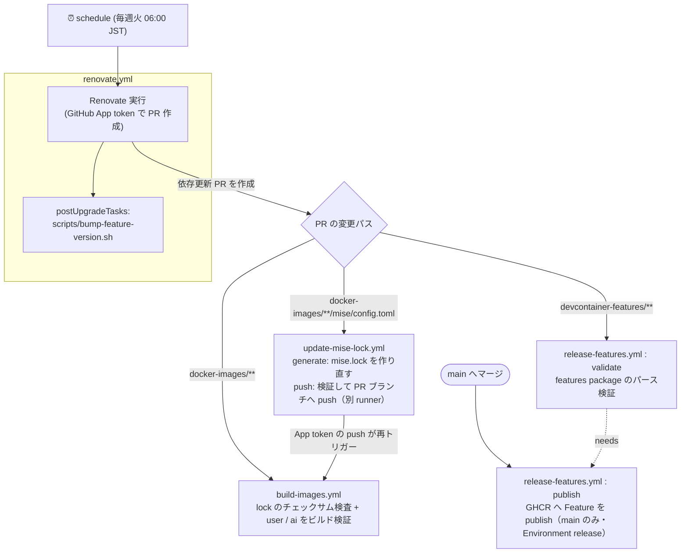

# devcontainer-template

開発用DevContainerベースイメージと、セキュアな開発用Feature、およびAIエージェント用コンテキストの一元管理リポジトリ  
**DevContainerのベースイメージ**と**共通Feature**を一元管理します。

開発者体験（DX）の向上と、サプライチェーン攻撃対策（DevSecOps）の両立を目的としています。

## 🎯 目的 (Goals)

* **環境構築のゼロ化:** 誰がどこでクローンしても、コマンド一発でセキュアな標準環境が立ち上がる状態を作る。
* **サプライチェーン保護:** `extensions.allowed`、mise の lockfile（チェックサム検証）と Renovate を活用し、検証済みの拡張機能・ツールのみを安全に配信する。
* **AIコンテキストの共通化:** コーディング規約や共通のMCP設定など、AIエージェントに必要な標準ルールを全プロジェクトへ提供する。

## 📁 ディレクトリ構造 (Architecture)

当リポジトリは、大きく2つの独立した成果物（アーティファクト）を生成・配信します。

- `docker-images` : プロジェクトの土台となる **Dockerベースイメージ**（OS・ランタイム）のビルド定義群。
- `devcontainer-features` : ベースイメージに依存せず、後から動的に注入できる **DevContainer Features**（拡張機能・ツール・AI設定）のソースコード群。

※ 注意: Feature（`devcontainer-features` 配下）のモジュール内には `Dockerfile` を含めず、関心の分離を徹底してください。

## 🧰 ツール管理 (mise)

CLI ツールは [mise](https://mise.jdx.dev/) で管理します。Python / Node / uv / Kiro CLI / Antigravity CLI も mise でインストールします。

- Python は python-build-standalone、Node は nodejs.org の公式バイナリで、どちらも `mise.lock` のチェックサムで検証されます。
- イメージに入れる Python パッケージは `docker-images/dev-base/opt/python/requirements.txt`（ハッシュ付き）から uv で mise の Python へ入ります。コンテナ内で `npm install -g` したパッケージは mise の Node の中へ入ります。
- **Node は LTS のみ**を使います。Renovate は LTS 以外（奇数メジャーや、LTS 入り前の偶数メジャー）へは更新せず、`build-images.yml` が `scripts/check-node-lts.sh` で指定中の版が LTS であることを検査します。

### 設定の配置

| ステージ | リポジトリ内のパス | イメージ内のパス | mise のスコープ |
| --- | --- | --- | --- |
| dev-base（ai / user 共通） | `docker-images/dev-base/etc/mise/` | `/etc/mise/` | system |
| ai | `docker-images/ai/opt/mise/` | `/opt/mise/`（`MISE_GLOBAL_CONFIG_FILE`） | global |
| user | `docker-images/user/opt/mise/` | `/opt/mise/`（`MISE_GLOBAL_CONFIG_FILE`） | global |
| ワークスペース | プロジェクトの `mise.toml` | `~/work/mise.toml` 等 | project |

- イメージ内の設定と `mise.lock` は root 所有で配置し、コンテナ内のユーザ（特に ai）からは書き換えられません。
- `locked = true` により、`mise.lock` に記録されていないツールのインストールを拒否し、記録済みのチェックサムで検証します。mise 自体はチェックサムの欠落を拒否しないため、欠落は `build-images.yml` で検出します（合わせて aqua の `require_checksum` 相当）。ワークスペースの `mise.toml` は実行中にツールを足す用途のため、lock を必須にしていません（`locked_scopes`）。
- **user コンテナは `paranoid = true`** です。ワークスペースは ai コンテナと共有しており、ai 側がワークスペースの `mise.toml` に任意のツールを書き込めるためです。ワークスペースに `mise.toml` を置いた場合は、内容を確認してから user コンテナで `mise trust` してください（trust するまで、その配下では mise のツールが使えません。詳細は[プロジェクトでツールのバージョンを上書きする](#プロジェクトでツールのバージョンを上書きする)）。

### ツールを追加・更新する

1. 対象ステージの `config.toml` を編集する（backend は `aqua:owner/repo` のように明示する）。
2. `mise.lock` を作り直す。PR 上では `update-mise-lock.yml` が自動で行うため、手元での実行は任意です。

   ```sh
   bash scripts/update-mise-locks.sh
   ```

`mise lock` は、配布元がチェックサムを提供しない成果物（aws-cli, docker/cli, google-cloud-sdk, claude-code など）のチェックサムを記録しません。`scripts/fill-mise-lock-checksums.sh` が成果物をダウンロードして sha256 を補完し、`build-images.yml` が欠落を検出します。

### プロジェクトでツールのバージョンを上書きする

本テンプレートを `.devcontainer/devcontainer-template` に配置して使う場合、プロジェクトルートは `/home/dev/work` にマウントされ、作業ディレクトリになります。mise はカレントディレクトリから親へ向かって設定を探すため、**プロジェクトルートに `mise.toml` を置くと、イメージ側（system / global）の設定より優先**されます。

例: イメージの Node は 24.14.1 だが、プロジェクトでは Node 18 を使う場合

```toml
# <プロジェクトルート>/mise.toml
[tools]
node = "18"
```

| カレントディレクトリ | 使われる Node |
| --- | --- |
| プロジェクトルート（`~/work`）とその配下 | 18（プロジェクトの `mise.toml`） |
| プロジェクト外（`~` など） | 24.14.1（イメージの設定） |

- **ファイル名は `mise.toml`** にする。`.mise.toml`、`.config/mise.toml`、`mise/config.toml` も使えるが、プロジェクト直下の `config.toml` は mise の設定ファイルとして認識されない。
- イメージに入っていないバージョンは、初めてコマンドを実行したときに自動でインストールされる（明示的に入れる場合は `mise install`）。
- イメージの `locked = true` は system / global の設定にのみ適用されるため、プロジェクトの `mise.toml` は lock が無くても使える。チェックサムを固定したい場合は、プロジェクトで `mise lock` を実行して `mise.lock` もコミットする。

**注意点:**

- **user コンテナでは `mise trust` が必要。** user コンテナは `paranoid = true` のため、プロジェクトの `mise.toml` は trust するまで読み込まれず、その配下では mise のツール全体が使えない。
  - 内容を確認してから trust する（`mise trust --show` で内容を表示できる）。

    ```sh
    mise trust mise.toml
    ```

  - trust はファイル内容のハッシュに紐づくため、`mise.toml` を編集すると再度 trust が必要になる（ai 側が書き換えても黙って読み込まれない）。
  - trust の記録はコンテナ内（`~/.local/state/mise`）にあるため、コンテナを作り直すと再度 trust が必要になる。
  - ai コンテナは通常モードのため trust は不要。
- **イメージの Node を前提にしたコマンドが使えなくなる。** コンテナ内でイメージの Node（24.14.1）に `npm install -g` したコマンドは、別の Node を指定したディレクトリでは `No version is set for shim` エラーになる。user コンテナの `renovate`（`/opt/renovate`）はその場で有効な Node で動くため、古い Node を指定したディレクトリでは Node のバージョン要件を満たせず失敗する。両方を有効にしたい場合は複数のバージョンを指定する（先頭のバージョンが優先される）。

  ```toml
  [tools]
  node = ["18", "24.14.1"]
  ```

- テンプレートの Node の LTS 検査（`scripts/check-node-lts.sh`）はテンプレート自身の設定だけが対象で、プロジェクトの `mise.toml` は検査しない。サポートが終了したバージョン（Node 18 は 2025 年 4 月に終了）を使う場合はプロジェクト側で判断すること。

## ⚙️ CI/CD パイプライン

### パイプラインの依存関係 (Pipeline Dependencies)

`.github/workflows/` の4ワークフローは、以下のように連鎖して動作します。



**依存関係のポイント:**

- **Renovate が起点:** `GITHUB_TOKEN` 発の push は他ワークフローを起動しないため、あえて GitHub App のトークンで PR を作る。これにより生成された PR が下流の CI を起動できる。
- **lock → build の連鎖:** mise は `locked = true` のため、`config.toml` だけ更新すると `mise.lock` と不一致になりビルドが失敗する。Renovate には lock を更新させず（`skipArtifactsUpdate`）、`update-mise-lock` が PR ブランチへ lock を push する。push は **GitHub App のトークン**で行うため、その push が改めて `build-images` を起こしてビルドが通ることを保証する。push したコミットは `gitIgnoredAuthors` により Renovate から「人の編集」とみなされない。
- **validate → publish:** `publish` は `needs: validate` かつ `if: github.event_name != 'pull_request' && github.ref == 'refs/heads/main'`。PR ではパース検証のみ、`main` からのみ GHCR へ publish する（手動実行で別ブランチを選んでも publish しない）。
- **version bump との連動:** Feature の `version` を上げないと `publish` は何も配信しない。そのため Renovate の `postUpgradeTasks` が `bump-feature-version.sh` で patch を上げる。

### Renovate の待機期間 (minimumReleaseAge)

公開直後の版は取り込まず、Docker イメージ・GitHub のリリース/タグ・Node・npm・PyPI は7日、VS Code 拡張機能は14日待ってから PR を作ります（`internalChecksFilter: strict` のため、待機中は PR を作らず Dependency Dashboard に表示されます）。

- **Docker Hub のページング上限:** Docker Hub のタグ一覧 API は匿名だと 1000 件（10ページ）を超えると 403 を返します。`library/debian` のようにタグが多いイメージでは、Renovate がリリース日時を取得できなくなり、PR が `renovate/stability-days` の pending のまま永久に更新されませんでした。`renovate.yml` で `RENOVATE_DOCKER_MAX_PAGES=10` を設定して回避しています。
- **Kiro CLI:** 配布元のマニフェストにリリース日時が無いため、待機期間を設定していません（設定すると同じく永久に pending になります）。

### サードパーティ Action 一覧 (Third-party Actions)

上記ワークフローで利用しているサードパーティ Action の一覧です。サプライチェーン保護のため、すべてコミット SHA で固定しています（Renovate が自動更新）。

| Action | バージョン | 利用ワークフロー |
| --- | --- | --- |
| [`actions/checkout`](https://github.com/actions/checkout) | v7.0.0 | build-images / release-features / update-mise-lock |
| [`actions/upload-artifact`](https://github.com/actions/upload-artifact) | v7.0.1 | update-mise-lock |
| [`actions/download-artifact`](https://github.com/actions/download-artifact) | v8.0.1 | update-mise-lock |
| [`devcontainers/action`](https://github.com/devcontainers/action) | v1.4.3 | release-features |
| [`actions/create-github-app-token`](https://github.com/actions/create-github-app-token) | v3.2.0 | renovate / update-mise-lock |
| [`renovatebot/github-action`](https://github.com/renovatebot/github-action) | v46.1.20 | renovate |

Action の SHA 固定だけでは、Action が実行時に取得するものまでは固定されません。以下は個別に固定しています。

| 対象 | 固定方法 | 利用ワークフロー |
| --- | --- | --- |
| Renovate 本体のコンテナ | `renovate.yml` の `CLI_IMAGE_TAG` でバージョン + digest を指定（Docker Hub の `renovate/renovate`） | renovate |
| Dev Containers CLI | `.github/tools/devcontainer-cli/package-lock.json` の integrity で固定し `npm ci` で事前導入 | release-features |
| mise | Dockerfile と同じ `jdxcode/mise` イメージ（タグ + digest 固定）の中で `mise lock` を実行 | update-mise-lock |

### セキュリティ上の設計 (Security)

- **App トークンの権限は最小化する:** `create-github-app-token` は `permission-*` を指定しないと App installation の全権限を継承するため、ワークフローごとに必要な権限だけを指定しています。
  - renovate: Contents / Issues / Pull requests / Checks / Commit statuses / Workflows（いずれも write）
  - update-mise-lock: Contents（write）のみ
  - 秘密鍵が漏えいした場合の影響も抑えたい場合は、lock 更新用に Contents 権限だけを持つ別の App を用意し、`update-mise-lock.yml` のシークレットを差し替えてください。
- **PR のコードを実行するジョブと、書き込みトークンを扱うジョブを分離する:** `update-mise-lock.yml` は lock を生成する `generate` ジョブと、push する `push` ジョブを別 runner で実行します。同じ runner で PR のコードを実行した後にトークンを扱うと、`.git/hooks` 等を仕込まれてトークンを盗まれるおそれがあるためです。`push` ジョブは PR のコードを実行せず、受け取った lock のファイル構成・形式・書き込み先（シンボリックリンクでないこと）を検証してから取り込みます。
- **publish は main からのみ:** `release-features.yml` の publish は `main` ブランチでのみ実行されます（`workflow_dispatch` で別ブランチを選んでも publish されません）。publish ジョブは Environment `release` を使います。**リポジトリ設定で `release` に「main ブランチのみ」のデプロイ制限と必須レビュアーを設定してください**（未設定の場合は保護ルールのない Environment として自動作成されます）。
- **イメージ内の依存も lock する:** Python パッケージは `docker-images/dev-base/opt/python/requirements.txt`（ハッシュ付き、`--require-hashes`）、ローカル確認用の Renovate CLI は `docker-images/user/opt/renovate/package-lock.json`（`npm ci --ignore-scripts`）で固定しています。いずれも Renovate が更新します。
  - Python パッケージの更新時、Renovate は `uv pip compile` で requirements.txt を再生成します。このとき推移的依存はその時点の最新版に解決され、minimumReleaseAge の待機は直接依存（`requirements.in`）にのみ適用されます。

リポジトリ側の設定（ブランチ保護、Actions の許可リスト、Environment の保護ルール）はワークフローからは確認できないため、別途確認してください。
