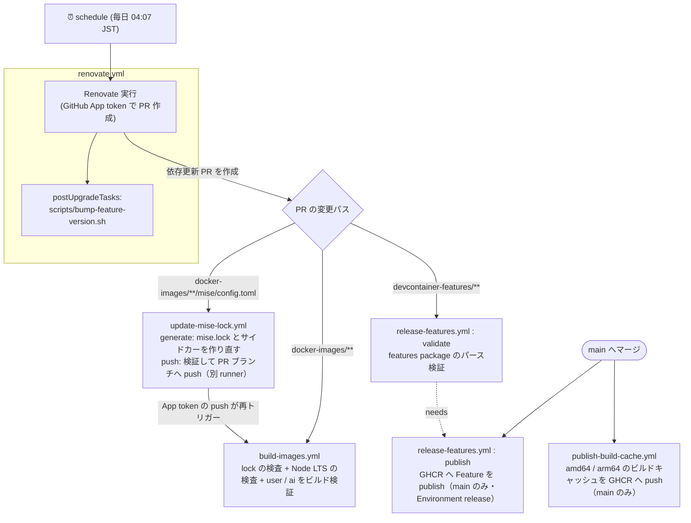

# 保守・開発ガイド

このリポジトリのイメージ・Feature・CI/CD を保守する人向けの資料です。利用方法は [README](../README.md) を参照してください。

## 目次

- [ディレクトリ構成](#ディレクトリ構成)
- [ツール管理 (mise)](#ツール管理-mise)
- [イメージ内のその他の依存](#イメージ内のその他の依存)
- [ビルドキャッシュ](#ビルドキャッシュ)
- [CI/CD パイプライン](#cicd-パイプライン)
- [Renovate](#renovate)
- [サードパーティ Action と実行時の依存](#サードパーティ-action-と実行時の依存)
- [セキュリティ上の設計](#セキュリティ上の設計)

## ディレクトリ構成

このリポジトリは、2つの独立した成果物を生成・配信します。

| パス | 成果物 |
| --- | --- |
| `docker-images/` | Dev Container のベースイメージ（`compose.yml` からビルド） |
| `devcontainer-features/` | Dev Container Features（GHCR へ publish） |

Feature（`devcontainer-features/` 配下）には `Dockerfile` を含めず、イメージと Feature の関心を分離してください。

```text
.
├── compose.yml                   # user / ai コンテナの定義
├── setup-docker-env.sh           # 利用者が実行する .env 生成スクリプト
├── docker-images/
│   ├── Dockerfile                # base → dev-base → ai / user のマルチステージ
│   ├── dev-base/                 # ai / user 共通
│   │   ├── etc/mise/             # mise の設定と lock（system スコープ）
│   │   ├── etc/profile.d/        # ログインシェルで mise shims の PATH を復元
│   │   ├── opt/python/           # Python パッケージ（requirements.in / requirements.txt）
│   │   └── usr/local/bin/        # entrypoint.sh
│   ├── ai/
│   │   ├── opt/mise/             # mise の設定と lock（global スコープ）
│   │   ├── etc/chromium.d/       # Chromium の起動オプション
│   │   ├── etc/chromium/policies/ # Chromium のポリシー（Antigravity のブラウザ拡張を入れる）
│   │   ├── usr/local/bin/        # ai-entrypoint.sh / start-desktop（デスクトップの起動）
│   │   ├── usr/share/icons/st/   # st のアイコン
│   │   └── home-config/          # AI エージェントとデスクトップ（KasmVNC / Openbox / idesk）の設定ファイル
│   └── user/
│       ├── opt/mise/             # mise の設定と lock（global スコープ）
│       ├── opt/renovate/         # ローカル確認用の Renovate CLI（package-lock.json）
│       └── usr/local/bin/        # ai（ai コンテナに入るコマンド）/ ai-desktop（aid）
├── devcontainer-features/        # vscode-common / vscode-python / vscode-terraform
├── scripts/                      # lock 更新・検査・Feature の version 更新
├── renovate.json5
└── .github/
    ├── workflows/
    ├── ci/compose.cache.yml      # CI でビルドキャッシュを書き出すための compose の上書き
    └── tools/devcontainer-cli/   # CI で使う Dev Containers CLI（package-lock.json）
```

## ツール管理 (mise)

CLI ツールと言語ランタイム（Python / Node.js）は [mise](https://mise.jdx.dev/) で管理します。

- mise 本体は、Dockerfile の `mise` ステージで公式イメージ `jdxcode/mise`（タグ + digest 固定）から取り出します。
- mise shims は Dockerfile の `ENV PATH` で有効にし、ログインシェルでは `/etc/profile.d/mise.sh` で復元します。Debian の `/etc/profile` が継承した `PATH` を上書きするため、Codex の shell snapshot などでもこの復元が必要です。設定変更後はイメージを再ビルドしてコンテナを再作成し、Codex も起動し直してください。
- Python は python-build-standalone、Node.js は nodejs.org の公式バイナリで、どちらも `mise.lock` のチェックサムで検証されます。
- ツールは backend を明示して記述します（例: `"aqua:jqlang/jq"`）。短縮名は mise のレジストリ次第で解決先の backend が変わり得るため使いません。`aqua:` は mise に組み込まれた aqua レジストリを使う backend で、aqua 本体は使いません。

### 設定の配置

| ステージ | リポジトリ内のパス | イメージ内のパス | mise のスコープ |
| --- | --- | --- | --- |
| dev-base（ai / user 共通） | `docker-images/dev-base/etc/mise/` | `/etc/mise/` | system |
| ai | `docker-images/ai/opt/mise/` | `/opt/mise/`（`MISE_GLOBAL_CONFIG_FILE`） | global |
| user | `docker-images/user/opt/mise/` | `/opt/mise/`（`MISE_GLOBAL_CONFIG_FILE`） | global |
| ワークスペース | 利用者のプロジェクトの `mise.toml` | `~/work/mise.toml` 等 | project |

- イメージ内の設定と `mise.lock` は root 所有・読み取り専用で配置し、コンテナ内のユーザー（特に ai）からは書き換えられません。パーミッションはビルドコンテキストに依存させず、Dockerfile で明示しています（`mise lock` は `mise.lock` を `0600` で書き出すため）。
- `locked = true` により、`mise.lock` に記録されていないツールのインストールを拒否し、記録済みのチェックサムで検証します。mise 自体はチェックサムの欠落を拒否しないため、欠落は `build-images.yml` で検出します。
- ワークスペースの `mise.toml` は利用者が実行中にツールを足す用途のため、lock を必須にしていません（`locked_scopes = ["system", "global"]`）。
- **user コンテナは `paranoid = true`** です。ワークスペースは ai コンテナと共有しており、ai 側がワークスペースの `mise.toml` に任意のツール（http backend の任意 URL 等）を書き込めるためです。paranoid モードの trust はファイル内容のハッシュに紐づくため、書き換えられた設定は再度 trust されるまで読み込まれません。
- **Node.js は LTS のみ**を使います。Renovate は LTS 以外へは更新せず、`build-images.yml` が `scripts/check-node-lts.sh` で指定中の版が LTS であることを検査します。
- **npm backend のツール**（ai の Playwright CLI）は、`mise lock` が依存グラフを integrity 付きで `mise.lock` と同じディレクトリの `.mise/locks/npm-<name>/<version>/`（`package.json` / `aube-lock.yaml`）にサイドカーとして書き出し、`mise.lock` にはその digest が記録されます。`mise install` はこのグラフを再生するため、推移的依存まで固定されます。サイドカーも `mise.lock` と一緒にコミットしてください（mise 2026.9.7 以上が必要）。

### ツールを追加・更新する

1. 対象ステージの `config.toml` を編集する（backend を明示する）。
2. `mise.lock` を作り直す。PR 上では `update-mise-lock.yml` が自動で行うため、手元での実行は任意です。

   ```sh
   bash scripts/update-mise-locks.sh
   ```

   mise はイメージと同じバージョンを使ってください（user コンテナ内の mise で実行するのが簡単です）。GitHub API を多用するため、`GITHUB_TOKEN` を設定して実行することを推奨します。

`scripts/update-mise-locks.sh` は次を行います。

- lock をゼロから生成する（古いエントリが残らないようにするため）。
- 配布元がチェックサムを提供しない成果物（aws-cli, docker/cli, google-cloud-sdk, claude-code など）は `mise lock` がチェックサムを記録しないため、`scripts/fill-mise-lock-checksums.sh` で成果物をダウンロードして sha256 を補完する。URL が変わっていなければ旧 lock の値を再利用する。
- 解決できなかったエントリ（skipped）や、linux-arm64 に x86_64 向けの成果物が記録されたエントリがあれば失敗する。npm backend のツールはプラットフォーム別の成果物を持たず、常にプラットフォーム数ぶん skipped になるため、その数だけは許容する（代わりに依存グラフ（`aube`）の記録があることを確認する）。
- npm backend のサイドカー（`.mise/locks/`）は消さずに残し、`mise lock` に再利用・整理させる（参照されなくなった版のディレクトリは `mise lock` が消す）。
- エントリの並び順だけが変わった場合は旧 lock を残す（mise lock は複数エントリの並び順が実行ごとに揺れるため）。

**プラットフォーム別の成果物を指定する場合の注意:** github backend の `asset_pattern` に `{{ arch() }}` を使うと、`mise lock` を実行したマシンのアーキテクチャで展開され、全プラットフォームに同じ成果物が記録されます。`[tools."github:owner/repo".platforms]` でプラットフォームごとに指定してください（`openai/codex` の設定を参照）。

## イメージ内のその他の依存

| 依存 | 定義 | 導入方法 |
| --- | --- | --- |
| Python パッケージ | `docker-images/dev-base/opt/python/requirements.in`（直接依存） / `requirements.txt`（推移的依存とハッシュ） | `uv pip install --system --require-hashes` |
| Renovate CLI（user） | `docker-images/user/opt/renovate/package.json` / `package-lock.json` | `npm ci --ignore-scripts` |
| KasmVNC（ai） | `docker-images/Dockerfile` の `KASMVNC_VERSION` / `KASMVNC_SHA256_*` | GitHub リリースの `.deb` を sha256 で検証して `apt-get install` |
| ブラウザ操作 CLI のスキル（ai） | `docker-images/ai/opt/rulesync/` / `docker-images/ai/opt/agent-browser-skills/`（`rulesync.jsonc` と `rulesync.lock`） | `rulesync install --frozen` で取得し `rulesync generate --global` で各ツールへ展開 |
| デスクトップ・Chromium（ai）、socat（user） | `docker-images/Dockerfile` | Debian のパッケージ（`apt-get`） |

- Python パッケージを変更したら、`docker-images/dev-base/opt/python` で次を実行して `requirements.txt` を再生成します。オプションは Renovate がヘッダーから解釈できるよう `=` でつなぎます。

  ```sh
  uv pip compile --universal --generate-hashes --python-version=3.14 --output-file=requirements.txt requirements.in
  ```

- Renovate CLI はインストールスクリプトを実行しないため、re2 のネイティブ拡張は入らず、標準の RegExp にフォールバックします。
- KasmVNC は Renovate の更新対象外です（アーキテクチャごとの sha256 を合わせて更新する必要があるため）。更新するときは Dockerfile のコメントの手順で、`KASMVNC_VERSION` と amd64 / arm64 の sha256 を書き換えてください。
- ブラウザは Google Chrome ではなく Debian の Chromium を使います（Google Chrome には Linux arm64 版が無いため）。
- Playwright CLI・agent-browser（ai）も、同梱のブラウザはダウンロードせず、Debian の Chromium を `PLAYWRIGHT_MCP_EXECUTABLE_PATH` / `AGENT_BROWSER_EXECUTABLE_PATH`（ともに `/usr/lib/chromium/chromium`）で使います。`/usr/bin/chromium` はラッパーで、`/etc/chromium.d/ai-desktop` のリモートデバッグ用ポートやプロファイルの指定を付け、デスクトップの Chromium と衝突するため実体を指定しています。

### ブラウザ操作 CLI のスキル（ai）

スキルの内容は書きません。各 CLI が配布しているものをそのまま使い、mise が固定したツールの版と一致させます（自作すると CLI の更新で陳腐化するため）。

- **playwright-cli** — npm パッケージ内の `SKILL.md` をイメージ内から取ります。
- **agent-browser** — GitHub リリースの素のバイナリにはスキルが入らないため、リポジトリから取ります。スキルは2層構造で、両方が必要です。
  - `skills/` … 各ツールへ渡す discovery stub（frontmatter に `hidden: true`）
  - `skill-data/` … stub が `agent-browser skills get core` で読ませる本体。`AGENT_BROWSER_SKILLS_DIR` から CLI が配る

取得は rulesync の宣言的ソースで行い、`rulesync.lock` がコミット SHA と成果物ごとのハッシュを固定します。ビルドは `rulesync install --frozen` なので、lock とズレていれば失敗します。GitHub API は匿名だと 60回/時で制限されビルドが落ちるため、**git transport** を使います。

`skill-data` 側（`docker-images/ai/opt/agent-browser-skills/`）は取得専用で、`rulesync generate` には通しません。`core` や `slack` という汎用名のスキルが全ツールに並び、stub の案内とも二重になるためです。

`rulesync.jsonc` の `ref` は Renovate の customManager が更新します（mise の agent-browser と同じ周期・同じグループになるよう `renovate.json5` で揃えています）。`ref` を変えたら lock を作り直す必要がありますが、PR 上では `update-rulesync-lock.yml` が自動で行うため、手元での実行は任意です。

```sh
bash scripts/update-rulesync-locks.sh
```

このスクリプトは作業用のコピーで `rulesync install --update` を実行し、生成された lock だけを書き戻します（取得結果 `.rulesync/` は作業ツリーに残しません）。書き戻す前に `--frozen` が通ることも確かめます。

`--update` は必須です。付けないと rulesync は lock にある解決済みコミットを再利用するため、`ref` を変えても lock が追従しません。また `rulesync.lock` は解決した時刻（`resolvedAt`）を持つので、時刻を除いた内容が同じなら旧 lock を残します。これをしないと、lock を push するワークフローが毎回差分を作り、その push がワークフロー自身を再び起動して止まらなくなります（`mise.lock` の並び順を握り潰しているのと同じ理由です）。

`update-rulesync-lock.yml` は `update-mise-lock.yml` と同じ構成です。PR のコードを実行する `generate` ジョブと、書き込み用トークンを扱う `push` ジョブを分離し、`push` 側は受け取った lock の形式（`lockfileVersion`、解決済みコミットが40桁の16進であること、成果物ごとの integrity が sha256 であること）を検証してから決まったパスにだけ書き込みます。rulesync は mise で管理しているため、`generate` ジョブは Dockerfile の mise ステージと同じイメージの中で `mise x` を使い、ai の設定に書かれたバージョンの rulesync で lock を作り直します。
- KasmVNC の TLS 証明書は、`ai` コンテナの起動時に `start-desktop` がコンテナごとに生成します。`ssl-cert` の証明書（snakeoil）はビルド時に作られ、公開しているビルドキャッシュを通じて全利用者で同じ秘密鍵になるため使いません。
- Python のマイナーバージョンを上げた場合は、`--python-version` を合わせて `requirements.txt` を再生成してください。

## ビルドキャッシュ

利用者のビルドを速くするため、`main` のイメージ定義からビルドした各層のキャッシュを GHCR に公開しています。イメージ自体は配布しません。

| 項目 | 内容 |
| --- | --- |
| 公開先 | `ghcr.io/diiva-szk/devcontainer-env-core/build-cache:{user,ai}-{amd64,arm64}` |
| 書き出し | `publish-build-cache.yml`（`main` への push 時）。amd64 は `ubuntu-24.04`、arm64 は `ubuntu-24.04-arm` のランナーでネイティブにビルドし、`mode=max` で中間ステージの層も書き出す |
| 読み込み | `compose.yml` の `cache_from`（利用者のビルドと `build-images.yml`） |

- 利用者のビルドは、`main` と内容が同じ層をダウンロードし、異なる層以降だけをローカルでビルドします。テンプレートのコミットが古くても壊れず、自然にローカルビルドへフォールバックします。
- 既定の `docker` ドライバーは containerd image store が有効な場合にのみレジストリキャッシュを使います。CI では `docker-container` ドライバーの builder（`moby/buildkit`、バージョン + digest 固定）を使います。
- キャッシュから取得した層では、mise のチェックサム検証などのビルド処理は再実行されません。「`main` から CI が書き出したキャッシュを信頼する」前提のため、書き出しは `main` からのみ行います。

### Dockerfile を変更するときのルール

キャッシュが利用者に効くかどうかは、Dockerfile の書き方で決まります。

- **利用者ごとに値が変わるビルド引数は、ステージの最後で宣言・使用する。** `ARG` は宣言以降のすべての `RUN` のキャッシュキーに含まれるため、途中で宣言すると、値を変えた利用者はそれ以降の層をキャッシュから取得できません（`USER_PASS` を user ステージの最後に置いているのはこのため）。
- **ホストごとに変わる値は、できるだけビルドせず起動時に渡す。** Docker ソケットのグループは `compose.yml` の `group_add`、ユーザーの UID / GID は Dev Containers の `updateRemoteUserUID` で起動時に合わせています。
- `base` ステージの `UID` / `GID` / `USER_NAME` / `TZ` は全層に影響します。既定値を変えると、利用者のキャッシュがすべて外れます。
- `compose.yml` と `publish-build-cache.yml` は同じ compose ファイル（同じビルド引数の既定値）でビルドし、キャッシュキーを一致させています。ビルド引数を追加・変更したときは両方で一致していることを確認してください。

## CI/CD パイプライン

`.github/workflows/` の5ワークフローは、以下のように連鎖して動作します。



- **Renovate が起点:** `GITHUB_TOKEN` 発の push は他ワークフローを起動しないため、GitHub App のトークンで PR を作ります。これにより生成された PR が下流の CI を起動できます。
- **実行間隔:** `renovate.yml` は毎日 04:07 JST に実行します。新しい更新 PR を作るのは、AI ツールは毎日、それ以外は火曜のみです（[更新のタイミング](#更新のタイミング)）。
- **lock → build の連鎖:** mise は `locked = true` のため、`config.toml` だけ更新すると `mise.lock` と不一致になりビルドが失敗します。Renovate には lock を更新させず（`skipArtifactsUpdate`）、`update-mise-lock` が PR ブランチへ lock を push します。push は GitHub App のトークンで行うため、その push が改めて `build-images` を起こします。push したコミットは `gitIgnoredAuthors` により Renovate から「人の編集」とみなされません。
- **validate → publish:** `publish` は `needs: validate` かつ `if: github.event_name != 'pull_request' && github.ref == 'refs/heads/main'` です。PR ではパース検証のみ行い、`main` からのみ GHCR へ publish します（手動実行で別ブランチを選んでも publish しません）。
- **version bump との連動:** Feature の `version` を上げないと `publish` は何も配信しません。Renovate の `postUpgradeTasks` が `scripts/bump-feature-version.sh` で patch を上げます。手作業で Feature を変更した場合は `version` を上げてください。

### 使用するシークレット

| シークレット | 内容 | 利用ワークフロー |
| --- | --- | --- |
| `RENOVATE_APP_CLIENT_ID` | GitHub App の Client ID | renovate / update-mise-lock |
| `RENOVATE_APP_PRIVATE_KEY` | GitHub App の秘密鍵 | renovate / update-mise-lock |

## Renovate

### 更新のタイミング

| 対象 | 新しい PR を作る曜日（`schedule`） | 待機期間（`minimumReleaseAge`） |
| --- | --- | --- |
| AI ツール（`docker-images/ai/opt/mise/config.toml`） | 毎日 | 1日（Kiro CLI はなし） |
| VS Code 拡張機能（`devcontainer-features/`） | 火曜 | 14日 |
| その他（Docker イメージ・mise の他のツール・Node.js・npm・PyPI など） | 火曜 | 7日 |
| 脆弱性修正（`vulnerabilityAlerts`） | 毎日（Renovate の既定で `schedule` の制限を受けない） | なし |

- `renovate.yml` は毎日実行し、`renovate.json5` の `schedule`（`* 0-11 * * 2` = 火曜 0〜11時 JST）で AI ツール以外の PR 作成を火曜に限定しています。GitHub Actions のスケジュール実行は遅れることがあるため、枠を広めに取っています。
- `schedule` は新しいブランチ・PR の作成を制限するもので、既存 PR のリベースなどは時間外でも行われます。
- `renovate.yml` を手動実行しても、火曜以外は AI ツールと脆弱性修正以外の新しい PR は作られません。
- AI ツールのルールは、Kiro CLI の `minimumReleaseAge: null` より前に置いています。packageRules は後のルールが優先されるため、順序を入れ替えると Kiro にも待機期間が適用され、リリース日時の無い Kiro の更新が永久に pending になります。

### 待機期間 (minimumReleaseAge)

公開直後の版は取り込まず、上表の待機期間を経た版だけを PR にします。`internalChecksFilter: strict` のため、待機中は PR を作らず Dependency Dashboard に表示されます。

待機期間はリリース日時を取得できるデータソースでしか機能しません。Renovate 42 以降の既定（`minimumReleaseAgeBehaviour: timestamp-required`）では、リリース日時が取れない版は **永久に pending** になり、既存の PR ブランチも更新されなくなります。新しい依存を追加する際は、データソースがリリース日時を返すことを確認してください。

- **Docker Hub のページング上限:** Docker Hub のタグ一覧 API は匿名だと 1000 件（10ページ）を超えると 403 を返します。`library/debian` のようにタグが多いイメージではリリース日時を取得できなくなるため、`renovate.yml` で `RENOVATE_DOCKER_MAX_PAGES=10` を設定しています（一覧は更新日時の新しい順のため、更新候補となる新しいタグは先頭側に含まれます）。
- **GHCR:** リリース日時を取得できないため、Renovate 本体のコンテナは Docker Hub の `renovate/renovate` を使っています。
- **Kiro CLI:** 配布元のマニフェストにリリース日時が無いため、待機期間を設定していません。
- **Python の推移的依存:** Renovate が `requirements.txt` を再生成する際、推移的依存はその時点の最新版に解決され、待機期間は直接依存（`requirements.in`）にのみ適用されます。

### 追跡方法の補足

| 依存 | 追跡方法 |
| --- | --- |
| mise の aqua / github / core backend のツール | Renovate の mise マネージャ（lock は `skipArtifactsUpdate` で更新させない） |
| Kiro CLI（http backend） | `customManagers` の正規表現 + `customDatasources`（latest マニフェスト） |
| mise の npm backend のツール（Playwright CLI） | Renovate の mise マネージャ（npm データソース）。依存グラフのサイドカー（`.mise/locks/`）は Renovate の対象外にし、`update-mise-lock.yml` が作り直す |
| Renovate 本体のコンテナ / BuildKit | `customManagers` の正規表現（`CLI_IMAGE_TAG` / `BUILDKIT_IMAGE_TAG` のバージョン + digest） |
| Python パッケージ | pip-compile マネージャ（`requirements.txt` のヘッダーのコマンドで再生成） |
| VS Code 拡張機能 | `customManagers` の正規表現（`// renovate:` コメント） |

## サードパーティ Action と実行時の依存

ワークフローで利用している Action は、すべてコミット SHA で固定しています（Renovate が自動更新）。

| Action | バージョン | 利用ワークフロー |
| --- | --- | --- |
| [`actions/checkout`](https://github.com/actions/checkout) | v7.0.0 | build-images / release-features / update-mise-lock |
| [`actions/upload-artifact`](https://github.com/actions/upload-artifact) | v7.0.1 | update-mise-lock |
| [`actions/download-artifact`](https://github.com/actions/download-artifact) | v8.0.1 | update-mise-lock |
| [`devcontainers/action`](https://github.com/devcontainers/action) | v1.4.3 | release-features |
| [`actions/create-github-app-token`](https://github.com/actions/create-github-app-token) | v3.2.0 | renovate / update-mise-lock |
| [`renovatebot/github-action`](https://github.com/renovatebot/github-action) | v46.1.20 | renovate |

Action の SHA 固定だけでは、Action が実行時に取得するものまでは固定されません。以下は個別に固定しています。

| 対象 | 固定方法 | 利用ワークフロー |
| --- | --- | --- |
| Renovate 本体のコンテナ | `renovate.yml` の `CLI_IMAGE_TAG` でバージョン + digest を指定 | renovate |
| BuildKit（docker-container ドライバー） | `BUILDKIT_IMAGE_TAG` でバージョン + digest を指定 | build-images / publish-build-cache |
| Dev Containers CLI | `.github/tools/devcontainer-cli/package-lock.json` の integrity で固定し `npm ci` で事前導入 | release-features |
| mise | Dockerfile と同じ `jdxcode/mise` イメージ（タグ + digest 固定）の中で `mise lock` を実行 | update-mise-lock |

## セキュリティ上の設計

- **user / ai の権限分離:** ai コンテナには sudo・Docker ソケット・クラウドの認証情報を渡しません。そのうえで AI エージェントは確認プロンプトなしで動作する設定にしています（`docker-images/ai/home-config/`）。この前提を崩す変更（ai への Docker ソケットのマウント等）をしないでください。
- **ai のデスクトップはホストに公開しない:** KasmVNC のポート（8444）は `compose.yml` の `expose` で同じネットワークの user コンテナにだけ見せ、`ports` でホストへは公開しません。ホストからは user コンテナの `ai-desktop`（`aid`）が `127.0.0.1` で待ち受けて転送し、VS Code のポート転送経由で開きます。
- **App トークンの権限の最小化:** `create-github-app-token` は `permission-*` を指定しないと App installation の全権限を継承するため、ワークフローごとに必要な権限だけを指定しています。
  - renovate: Contents / Issues / Pull requests / Checks / Commit statuses / Workflows（write）、Dependabot alerts（read。`vulnerabilityAlerts` 用）
  - update-mise-lock: Contents（write）のみ
- **PR のコードを実行するジョブと、書き込みトークンを扱うジョブの分離:** `update-mise-lock.yml` は lock を生成する `generate` ジョブと push する `push` ジョブを別 runner で実行します。同じ runner で PR のコードを実行した後にトークンを扱うと、`.git/hooks` 等を仕込まれてトークンを盗まれるおそれがあるためです。`push` ジョブは PR のコードを実行せず、受け取った lock のファイル構成・形式・書き込み先（シンボリックリンクでないこと）を検証してから取り込みます。
- **publish は main からのみ:** `release-features.yml` の publish は `main` ブランチでのみ実行し、Environment `release` を使います。
- **ビルドキャッシュの書き出しは main からのみ:** 利用者のビルドに取り込まれるため、`publish-build-cache.yml` は `main` でのみ `packages: write` を使います。PR のビルド（`build-images.yml`）はキャッシュを読むだけです。
- **イメージ内の依存の固定:** mise のツールは `mise.lock`、Python パッケージはハッシュ付き `requirements.txt`、Renovate CLI は `package-lock.json` で固定しています。
