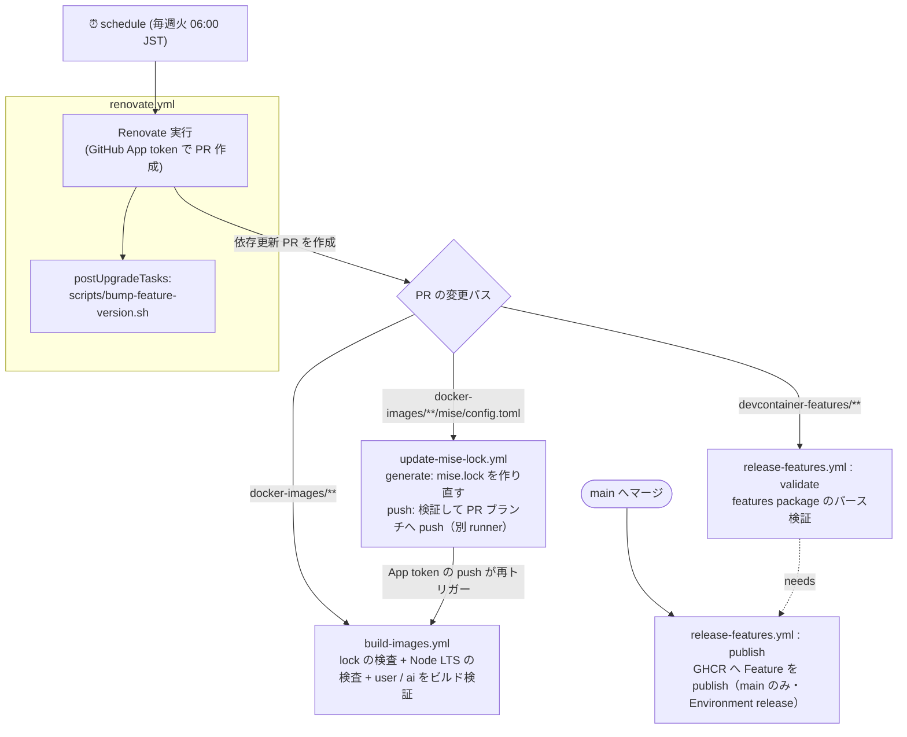

# 保守・開発ガイド

このリポジトリのイメージ・Feature・CI/CD を保守する人向けの資料です。利用方法は [README](../README.md) を参照してください。

## 目次

- [ディレクトリ構成](#ディレクトリ構成)
- [ツール管理 (mise)](#ツール管理-mise)
- [イメージ内のその他の依存](#イメージ内のその他の依存)
- [CI/CD パイプライン](#cicd-パイプライン)
- [Renovate](#renovate)
- [サードパーティ Action と実行時の依存](#サードパーティ-action-と実行時の依存)
- [セキュリティ上の設計](#セキュリティ上の設計)

## ディレクトリ構成

このリポジトリは、2つの独立した成果物を生成・配信します。

| パス | 成果物 |
| --- | --- |
| `docker-images/` | Dev Container のベースイメージ（`compose.yml` からビルド） |
| `devcontainer-features/` | Dev Container Features（GHCR へ publish） |

Feature（`devcontainer-features/` 配下）には `Dockerfile` を含めず、イメージと Feature の関心を分離してください。

```text
.
├── compose.yml                   # user / ai コンテナの定義
├── setup-docker-env.sh           # 利用者が実行する .env 生成スクリプト
├── docker-images/
│   ├── Dockerfile                # base → dev-base → ai / user のマルチステージ
│   ├── dev-base/                 # ai / user 共通
│   │   ├── etc/mise/             # mise の設定と lock（system スコープ）
│   │   ├── opt/python/           # Python パッケージ（requirements.in / requirements.txt）
│   │   └── usr/local/bin/        # entrypoint.sh
│   ├── ai/
│   │   ├── opt/mise/             # mise の設定と lock（global スコープ）
│   │   └── home-config/          # AI エージェントの設定ファイル
│   └── user/
│       ├── opt/mise/             # mise の設定と lock（global スコープ）
│       └── opt/renovate/         # ローカル確認用の Renovate CLI（package-lock.json）
├── devcontainer-features/        # vscode-common / vscode-python / vscode-terraform
├── scripts/                      # lock 更新・検査・Feature の version 更新
├── renovate.json5
└── .github/
    ├── workflows/
    └── tools/devcontainer-cli/   # CI で使う Dev Containers CLI（package-lock.json）
```

## ツール管理 (mise)

CLI ツールと言語ランタイム（Python / Node.js）は [mise](https://mise.jdx.dev/) で管理します。

- mise 本体は、Dockerfile の `mise` ステージで公式イメージ `jdxcode/mise`（タグ + digest 固定）から取り出します。
- Python は python-build-standalone、Node.js は nodejs.org の公式バイナリで、どちらも `mise.lock` のチェックサムで検証されます。
- ツールは backend を明示して記述します（例: `"aqua:jqlang/jq"`）。短縮名は mise のレジストリ次第で解決先の backend が変わり得るため使いません。`aqua:` は mise に組み込まれた aqua レジストリを使う backend で、aqua 本体は使いません。

### 設定の配置

| ステージ | リポジトリ内のパス | イメージ内のパス | mise のスコープ |
| --- | --- | --- | --- |
| dev-base（ai / user 共通） | `docker-images/dev-base/etc/mise/` | `/etc/mise/` | system |
| ai | `docker-images/ai/opt/mise/` | `/opt/mise/`（`MISE_GLOBAL_CONFIG_FILE`） | global |
| user | `docker-images/user/opt/mise/` | `/opt/mise/`（`MISE_GLOBAL_CONFIG_FILE`） | global |
| ワークスペース | 利用者のプロジェクトの `mise.toml` | `~/work/mise.toml` 等 | project |

- イメージ内の設定と `mise.lock` は root 所有・読み取り専用で配置し、コンテナ内のユーザー（特に ai）からは書き換えられません。パーミッションはビルドコンテキストに依存させず、Dockerfile で明示しています（`mise lock` は `mise.lock` を `0600` で書き出すため）。
- `locked = true` により、`mise.lock` に記録されていないツールのインストールを拒否し、記録済みのチェックサムで検証します。mise 自体はチェックサムの欠落を拒否しないため、欠落は `build-images.yml` で検出します。
- ワークスペースの `mise.toml` は利用者が実行中にツールを足す用途のため、lock を必須にしていません（`locked_scopes = ["system", "global"]`）。
- **user コンテナは `paranoid = true`** です。ワークスペースは ai コンテナと共有しており、ai 側がワークスペースの `mise.toml` に任意のツール（http backend の任意 URL 等）を書き込めるためです。paranoid モードの trust はファイル内容のハッシュに紐づくため、書き換えられた設定は再度 trust されるまで読み込まれません。
- **Node.js は LTS のみ**を使います。Renovate は LTS 以外へは更新せず、`build-images.yml` が `scripts/check-node-lts.sh` で指定中の版が LTS であることを検査します。

### ツールを追加・更新する

1. 対象ステージの `config.toml` を編集する（backend を明示する）。
2. `mise.lock` を作り直す。PR 上では `update-mise-lock.yml` が自動で行うため、手元での実行は任意です。

   ```sh
   bash scripts/update-mise-locks.sh
   ```

   mise はイメージと同じバージョンを使ってください（user コンテナ内の mise で実行するのが簡単です）。GitHub API を多用するため、`GITHUB_TOKEN` を設定して実行することを推奨します。

`scripts/update-mise-locks.sh` は次を行います。

- lock をゼロから生成する（古いエントリが残らないようにするため）。
- 配布元がチェックサムを提供しない成果物（aws-cli, docker/cli, google-cloud-sdk, claude-code など）は `mise lock` がチェックサムを記録しないため、`scripts/fill-mise-lock-checksums.sh` で成果物をダウンロードして sha256 を補完する。URL が変わっていなければ旧 lock の値を再利用する。
- 解決できなかったエントリ（skipped）や、linux-arm64 に x86_64 向けの成果物が記録されたエントリがあれば失敗する。
- エントリの並び順だけが変わった場合は旧 lock を残す（mise lock は複数エントリの並び順が実行ごとに揺れるため）。

**プラットフォーム別の成果物を指定する場合の注意:** github backend の `asset_pattern` に `{{ arch() }}` を使うと、`mise lock` を実行したマシンのアーキテクチャで展開され、全プラットフォームに同じ成果物が記録されます。`[tools."github:owner/repo".platforms]` でプラットフォームごとに指定してください（`openai/codex` の設定を参照）。

## イメージ内のその他の依存

| 依存 | 定義 | 導入方法 |
| --- | --- | --- |
| Python パッケージ | `docker-images/dev-base/opt/python/requirements.in`（直接依存） / `requirements.txt`（推移的依存とハッシュ） | `uv pip install --system --require-hashes` |
| Renovate CLI（user） | `docker-images/user/opt/renovate/package.json` / `package-lock.json` | `npm ci --ignore-scripts` |

- Python パッケージを変更したら、`docker-images/dev-base/opt/python` で次を実行して `requirements.txt` を再生成します。オプションは Renovate がヘッダーから解釈できるよう `=` でつなぎます。

  ```sh
  uv pip compile --universal --generate-hashes --python-version=3.14 --output-file=requirements.txt requirements.in
  ```

- Renovate CLI はインストールスクリプトを実行しないため、re2 のネイティブ拡張は入らず、標準の RegExp にフォールバックします。
- Python のマイナーバージョンを上げた場合は、`--python-version` を合わせて `requirements.txt` を再生成してください。

## CI/CD パイプライン

`.github/workflows/` の4ワークフローは、以下のように連鎖して動作します。



- **Renovate が起点:** `GITHUB_TOKEN` 発の push は他ワークフローを起動しないため、GitHub App のトークンで PR を作ります。これにより生成された PR が下流の CI を起動できます。
- **lock → build の連鎖:** mise は `locked = true` のため、`config.toml` だけ更新すると `mise.lock` と不一致になりビルドが失敗します。Renovate には lock を更新させず（`skipArtifactsUpdate`）、`update-mise-lock` が PR ブランチへ lock を push します。push は GitHub App のトークンで行うため、その push が改めて `build-images` を起こします。push したコミットは `gitIgnoredAuthors` により Renovate から「人の編集」とみなされません。
- **validate → publish:** `publish` は `needs: validate` かつ `if: github.event_name != 'pull_request' && github.ref == 'refs/heads/main'` です。PR ではパース検証のみ行い、`main` からのみ GHCR へ publish します（手動実行で別ブランチを選んでも publish しません）。
- **version bump との連動:** Feature の `version` を上げないと `publish` は何も配信しません。Renovate の `postUpgradeTasks` が `scripts/bump-feature-version.sh` で patch を上げます。手作業で Feature を変更した場合は `version` を上げてください。

### 使用するシークレット

| シークレット | 内容 | 利用ワークフロー |
| --- | --- | --- |
| `RENOVATE_APP_CLIENT_ID` | GitHub App の Client ID | renovate / update-mise-lock |
| `RENOVATE_APP_PRIVATE_KEY` | GitHub App の秘密鍵 | renovate / update-mise-lock |

## Renovate

### 待機期間 (minimumReleaseAge)

公開直後の版は取り込まず、Docker イメージ・GitHub のリリース/タグ・Node.js・npm・PyPI は7日、VS Code 拡張機能は14日待ってから PR を作ります。`internalChecksFilter: strict` のため、待機中は PR を作らず Dependency Dashboard に表示されます。

待機期間はリリース日時を取得できるデータソースでしか機能しません。Renovate 42 以降の既定（`minimumReleaseAgeBehaviour: timestamp-required`）では、リリース日時が取れない版は **永久に pending** になり、既存の PR ブランチも更新されなくなります。新しい依存を追加する際は、データソースがリリース日時を返すことを確認してください。

- **Docker Hub のページング上限:** Docker Hub のタグ一覧 API は匿名だと 1000 件（10ページ）を超えると 403 を返します。`library/debian` のようにタグが多いイメージではリリース日時を取得できなくなるため、`renovate.yml` で `RENOVATE_DOCKER_MAX_PAGES=10` を設定しています（一覧は更新日時の新しい順のため、更新候補となる新しいタグは先頭側に含まれます）。
- **GHCR:** リリース日時を取得できないため、Renovate 本体のコンテナは Docker Hub の `renovate/renovate` を使っています。
- **Kiro CLI:** 配布元のマニフェストにリリース日時が無いため、待機期間を設定していません。
- **Python の推移的依存:** Renovate が `requirements.txt` を再生成する際、推移的依存はその時点の最新版に解決され、待機期間は直接依存（`requirements.in`）にのみ適用されます。

### 追跡方法の補足

| 依存 | 追跡方法 |
| --- | --- |
| mise の aqua / github / core backend のツール | Renovate の mise マネージャ（lock は `skipArtifactsUpdate` で更新させない） |
| Kiro CLI（http backend） | `customManagers` の正規表現 + `customDatasources`（latest マニフェスト） |
| Renovate 本体のコンテナ | `customManagers` の正規表現（`CLI_IMAGE_TAG` のバージョン + digest） |
| Python パッケージ | pip-compile マネージャ（`requirements.txt` のヘッダーのコマンドで再生成） |
| VS Code 拡張機能 | `customManagers` の正規表現（`// renovate:` コメント） |

## サードパーティ Action と実行時の依存

ワークフローで利用している Action は、すべてコミット SHA で固定しています（Renovate が自動更新）。

| Action | バージョン | 利用ワークフロー |
| --- | --- | --- |
| [`actions/checkout`](https://github.com/actions/checkout) | v7.0.0 | build-images / release-features / update-mise-lock |
| [`actions/upload-artifact`](https://github.com/actions/upload-artifact) | v7.0.1 | update-mise-lock |
| [`actions/download-artifact`](https://github.com/actions/download-artifact) | v8.0.1 | update-mise-lock |
| [`devcontainers/action`](https://github.com/devcontainers/action) | v1.4.3 | release-features |
| [`actions/create-github-app-token`](https://github.com/actions/create-github-app-token) | v3.2.0 | renovate / update-mise-lock |
| [`renovatebot/github-action`](https://github.com/renovatebot/github-action) | v46.1.20 | renovate |

Action の SHA 固定だけでは、Action が実行時に取得するものまでは固定されません。以下は個別に固定しています。

| 対象 | 固定方法 | 利用ワークフロー |
| --- | --- | --- |
| Renovate 本体のコンテナ | `renovate.yml` の `CLI_IMAGE_TAG` でバージョン + digest を指定 | renovate |
| Dev Containers CLI | `.github/tools/devcontainer-cli/package-lock.json` の integrity で固定し `npm ci` で事前導入 | release-features |
| mise | Dockerfile と同じ `jdxcode/mise` イメージ（タグ + digest 固定）の中で `mise lock` を実行 | update-mise-lock |

## セキュリティ上の設計

- **user / ai の権限分離:** ai コンテナには sudo・Docker ソケット・クラウドの認証情報を渡しません。そのうえで AI エージェントは確認プロンプトなしで動作する設定にしています（`docker-images/ai/home-config/`）。この前提を崩す変更（ai への Docker ソケットのマウント等）をしないでください。
- **App トークンの権限の最小化:** `create-github-app-token` は `permission-*` を指定しないと App installation の全権限を継承するため、ワークフローごとに必要な権限だけを指定しています。
  - renovate: Contents / Issues / Pull requests / Checks / Commit statuses / Workflows（write）、Dependabot alerts（read。`vulnerabilityAlerts` 用）
  - update-mise-lock: Contents（write）のみ
- **PR のコードを実行するジョブと、書き込みトークンを扱うジョブの分離:** `update-mise-lock.yml` は lock を生成する `generate` ジョブと push する `push` ジョブを別 runner で実行します。同じ runner で PR のコードを実行した後にトークンを扱うと、`.git/hooks` 等を仕込まれてトークンを盗まれるおそれがあるためです。`push` ジョブは PR のコードを実行せず、受け取った lock のファイル構成・形式・書き込み先（シンボリックリンクでないこと）を検証してから取り込みます。
- **publish は main からのみ:** `release-features.yml` の publish は `main` ブランチでのみ実行し、Environment `release` を使います。
- **イメージ内の依存の固定:** mise のツールは `mise.lock`、Python パッケージはハッシュ付き `requirements.txt`、Renovate CLI は `package-lock.json` で固定しています。
