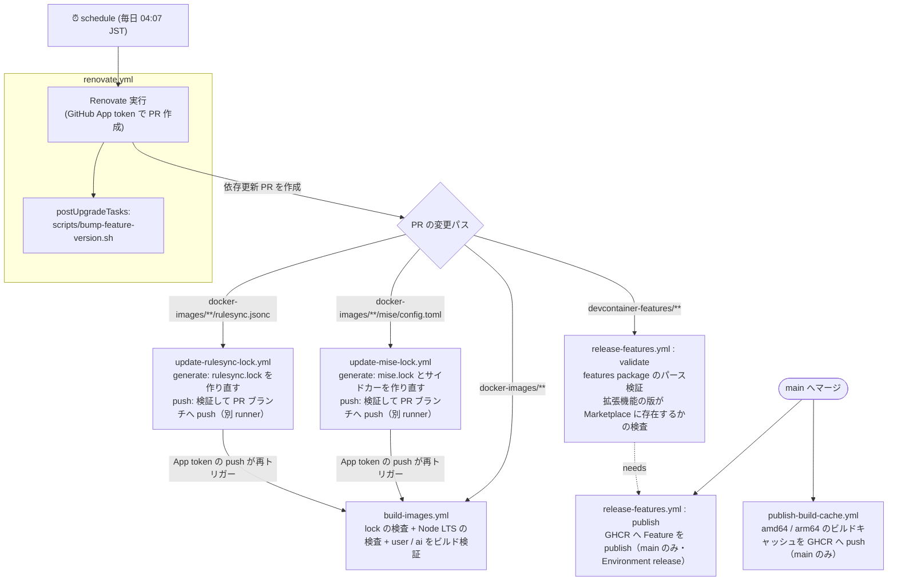

# 保守・開発ガイド

このリポジトリのイメージ・Feature・CI/CD を保守する人向けの資料です。利用方法は [README](../README.md) を参照してください。

## 目次

- [ディレクトリ構成](#ディレクトリ構成)
- [ツール管理 (mise)](#ツール管理-mise)
- [イメージ内のその他の依存](#イメージ内のその他の依存)
- [ビルドキャッシュ](#ビルドキャッシュ)
- [CI/CD パイプライン](#cicd-パイプライン)
- [Renovate](#renovate)
- [サードパーティ Action と実行時の依存](#サードパーティ-action-と実行時の依存)
- [セキュリティ上の設計](#セキュリティ上の設計)

## ディレクトリ構成

このリポジトリは、2つの独立した成果物を生成・配信します。

| パス | 成果物 |
| --- | --- |
| `docker-images/` | Dev Container のベースイメージ（`compose.yml` からビルド） |
| `devcontainer-features/` | Dev Container Features（GHCR へ publish） |

Feature（`devcontainer-features/` 配下）には `Dockerfile` を含めず、イメージと Feature の関心を分離してください。

```text
.
├── compose.yml                   # user / ai コンテナの定義
├── docker-images/
│   ├── Dockerfile                # base → dev-base → ai / user のマルチステージ
│   ├── dev-base/                 # ai / user 共通
│   │   ├── etc/mise/             # mise の設定と lock（system スコープ）
│   │   ├── etc/profile.d/        # ログインシェルで mise shims の PATH を復元
│   │   ├── opt/python/           # Python パッケージ（requirements.in / requirements.txt）
│   │   └── usr/local/bin/        # entrypoint.sh / google-chrome（共通の起動オプションを付けるラッパー。user 用）
│   ├── ai/
│   │   ├── opt/mise/             # mise の設定と lock（global スコープ）
│   │   ├── opt/rulesync/         # AI ツールのスキルの取得と各ツールへの展開（rulesync.jsonc / rulesync.lock / find-docs.version / find-docs・drawio-png の vendoring）
│   │   ├── opt/agent-browser-skills/ # agent-browser のスキル本体の取得（rulesync.jsonc / rulesync.lock）
│   │   ├── opt/drawio-webapp/    # dip に渡す draw.io の Web 資材の取得対象のパス（sparse-checkout）
│   │   ├── opt/drawio-libraries/ # dip のライブラリと一緒に配置するライセンス表記（ライブラリの XML 自体は mise で取得）
│   │   ├── usr/local/bin/        # ai-entrypoint.sh / start-desktop（デスクトップの起動）/ start-sshd（ssh サーバーの起動）/ sync-home-defaults / google-chrome（ai 用のラッパー。dev-base のものを置き換える）
│   │   ├── usr/share/icons/st/   # st のアイコン
│   │   └── home-config/          # AI エージェントとデスクトップ（KasmVNC / Openbox / idesk）の設定ファイル
│   └── user/
│       ├── opt/mise/             # mise の設定と lock（global スコープ）
│       ├── opt/renovate/         # ローカル確認用の Renovate CLI（package-lock.json）
│       └── usr/local/bin/        # ai（ai コンテナに ssh で入るコマンド）/ ai-desktop（aid）
├── devcontainer-features/        # vscode-common / vscode-python / vscode-terraform
├── scripts/                      # lock 更新・検査・Feature の version 更新
├── renovate.json5
└── .github/
    ├── workflows/
    ├── ci/compose.cache.yml      # CI でビルドキャッシュを書き出すための compose の上書き
    └── tools/devcontainer-cli/   # CI で使う Dev Containers CLI（package-lock.json）
```

## ツール管理 (mise)

CLI ツールと言語ランタイム（Python / Node.js）は [mise](https://mise.jdx.dev/) で管理します。

- mise 本体は、Dockerfile の `mise` ステージで公式イメージ `jdxcode/mise`（タグ + digest 固定）から取り出します。
- mise shims は Dockerfile の `ENV PATH` で有効にし、ログインシェルでは `/etc/profile.d/mise.sh` で復元します。Debian の `/etc/profile` が継承した `PATH` を上書きするため、Codex の shell snapshot などでもこの復元が必要です。設定変更後はイメージを再ビルドしてコンテナを再作成し、Codex も起動し直してください。
- Python は python-build-standalone、Node.js は nodejs.org の公式バイナリで、どちらも `mise.lock` のチェックサムで検証されます。
- ツールは backend を明示して記述します（例: `"aqua:jqlang/jq"`）。短縮名は mise のレジストリ次第で解決先の backend が変わり得るため使いません。`aqua:` は mise に組み込まれた aqua レジストリを使う backend で、aqua 本体は使いません。

### 設定の配置

| ステージ | リポジトリ内のパス | イメージ内のパス | mise のスコープ |
| --- | --- | --- | --- |
| dev-base（ai / user 共通） | `docker-images/dev-base/etc/mise/` | `/etc/mise/` | system |
| ai | `docker-images/ai/opt/mise/` | `/opt/mise/`（`MISE_GLOBAL_CONFIG_FILE`） | global |
| user | `docker-images/user/opt/mise/` | `/opt/mise/`（`MISE_GLOBAL_CONFIG_FILE`） | global |
| ワークスペース | 利用者のプロジェクトの `mise.toml` | `~/work/mise.toml` 等 | project |

- イメージ内の設定と `mise.lock` は root 所有・読み取り専用で配置し、コンテナ内のユーザー（特に ai）からは書き換えられません。パーミッションはビルドコンテキストに依存させず、Dockerfile で明示しています（`mise lock` は `mise.lock` を `0600` で書き出すため）。
- `locked = true` により、`mise.lock` に記録されていないツールのインストールを拒否し、記録済みのチェックサムで検証します。mise 自体はチェックサムの欠落を拒否しないため、欠落は `build-images.yml` で検出します。
- ワークスペースの `mise.toml` は利用者が実行中にツールを足す用途のため、lock を必須にしていません（`locked_scopes = ["system", "global"]`）。
- **user コンテナは `paranoid = true`** です。ワークスペースは ai コンテナと共有しており、ai 側がワークスペースの `mise.toml` に任意のツール（http backend の任意 URL 等）を書き込めるためです。paranoid モードの trust はファイル内容のハッシュに紐づくため、書き換えられた設定は再度 trust されるまで読み込まれません。
- **Node.js は LTS のみ**を使います。Renovate は LTS 以外へは更新せず、`build-images.yml` が `scripts/check-node-lts.sh` で指定中の版が LTS であることを検査します。
- **npm backend のツール**（ai の Playwright CLI）は、`mise lock` が依存グラフを integrity 付きで `mise.lock` と同じディレクトリの `.mise/locks/npm-<name>/<version>/`（`package.json` / `aube-lock.yaml`）にサイドカーとして書き出し、`mise.lock` にはその digest が記録されます。`mise install` はこのグラフを再生するため、推移的依存まで固定されます。サイドカーも `mise.lock` と一緒にコミットしてください（mise 2026.9.7 以上が必要）。

### ツールを追加・更新する

1. 対象ステージの `config.toml` を編集する（backend を明示する）。
2. `mise.lock` を作り直す。PR 上では `update-mise-lock.yml` が自動で行うため、手元での実行は任意です。

   ```sh
   bash scripts/update-mise-locks.sh
   ```

   mise はイメージと同じバージョンを使ってください（user コンテナ内の mise で実行するのが簡単です）。GitHub API を多用するため、`GITHUB_TOKEN` を設定して実行することを推奨します。

`scripts/update-mise-locks.sh` は次を行います。

- lock をゼロから生成する（古いエントリが残らないようにするため）。
- 配布元がチェックサムを提供しない成果物（aws-cli, google-cloud-sdk, claude-code など）は `mise lock` がチェックサムを記録しないため、`scripts/fill-mise-lock-checksums.sh` で成果物をダウンロードして sha256 を補完する。URL が変わっていなければ旧 lock の値を再利用する。
- 解決できなかったエントリ（skipped）や、linux-arm64 に x86_64 向けの成果物が記録されたエントリがあれば失敗する。npm backend のツールはプラットフォーム別の成果物を持たず、常にプラットフォーム数ぶん skipped になるため、その数だけは許容する（代わりに依存グラフ（`aube`）の記録があることを確認する）。
- npm backend のサイドカー（`.mise/locks/`）は消さずに残し、`mise lock` に再利用・整理させる（参照されなくなった版のディレクトリは `mise lock` が消す）。
- エントリの並び順だけが変わった場合は旧 lock を残す（mise lock は複数エントリの並び順が実行ごとに揺れるため）。

**プラットフォーム別の成果物を指定する場合の注意:** github backend の `asset_pattern` に `{{ arch() }}` を使うと、`mise lock` を実行したマシンのアーキテクチャで展開され、全プラットフォームに同じ成果物が記録されます。`[tools."github:owner/repo".platforms]` でプラットフォームごとに指定してください（`openai/codex` の設定を参照）。

## イメージ内のその他の依存

| 依存 | 定義 | 導入方法 |
| --- | --- | --- |
| Python パッケージ | `docker-images/dev-base/opt/python/requirements.in`（直接依存） / `requirements.txt`（推移的依存とハッシュ） | `uv pip install --system --require-hashes` |
| Renovate CLI（user） | `docker-images/user/opt/renovate/package.json` / `package-lock.json` | `npm ci --ignore-scripts` |
| draw.io の Web 資材（ai） | `docker-images/Dockerfile` の `DRAWIO_WEBAPP_COMMIT` と `docker-images/ai/opt/drawio-webapp/sparse-checkout` | 固定したコミットから git の sparse checkout で必要なパスだけを取得し、`/opt/drawio-webapp` に配置（[draw.io の Web 資材](#drawio-の-web-資材ai)を参照） |
| KasmVNC（ai） | `docker-images/Dockerfile` の `KASMVNC_VERSION` / `KASMVNC_SHA256_*` | GitHub リリースの `.deb` を sha256 で検証して `apt-get install` |
| ブラウザ操作 CLI のスキル（ai） | `docker-images/ai/opt/rulesync/` / `docker-images/ai/opt/agent-browser-skills/`（`rulesync.jsonc` と `rulesync.lock`） | `rulesync install --frozen` で取得し `rulesync generate --global` で各ツールへ展開 |
| find-docs スキル（ai） | `docker-images/ai/opt/rulesync/.rulesync/skills/find-docs/SKILL.md`（vendoring） | `rulesync generate --global` で各ツールへ展開（取得は手動。[AI ツールのスキル](#ai-ツールのスキルai)を参照） |
| dip のライブラリ（ai。Simple Icons） | `docker-images/ai/opt/mise/config.toml`（`github:mondeja/simple-icons-drawio`）と `mise.lock` | mise で取得し、Dockerfile で `/opt/drawio-libraries` へコピーして `DIP_LIBRARY_PATH` で指す（[dip のライブラリ](#dip-のライブラリai)を参照） |
| drawio-png スキル（ai） | `docker-images/ai/opt/rulesync/.rulesync/skills/drawio-png/SKILL.md`（vendoring） | `rulesync generate --global` で各ツールへ展開（取得は手動。[drawio-png の vendoring](#drawio-png-の-vendoring)を参照） |
| デスクトップ（ai）、socat（user） | `docker-images/Dockerfile` | Debian のパッケージ（`apt-get`） |
| Google Chrome（ai / user） | `docker-images/Dockerfile` | Google の apt リポジトリ（署名鍵の主鍵のフィンガープリントを `GOOGLE_LINUX_SIGNING_KEY_FPR` で照合）から `apt-get install` |

- Python パッケージを変更したら、`docker-images/dev-base/opt/python` で次を実行して `requirements.txt` を再生成します。オプションは Renovate がヘッダーから解釈できるよう `=` でつなぎます。

  ```sh
  uv pip compile --universal --generate-hashes --python-version=3.14 --output-file=requirements.txt requirements.in
  ```

- Python のマイナーバージョンを上げた場合は、`--python-version` を合わせて `requirements.txt` を再生成してください。
- Renovate CLI はインストールスクリプトを実行しないため、re2 のネイティブ拡張は入らず、標準の RegExp にフォールバックします。
- KasmVNC は Renovate の更新対象外です（アーキテクチャごとの sha256 を合わせて更新する必要があるため）。更新するときは Dockerfile のコメントの手順で、`KASMVNC_VERSION` と amd64 / arm64 の sha256 を書き換えてください。
- KasmVNC の TLS 証明書は、`ai` コンテナの起動時に `start-desktop` がコンテナごとに生成します。`ssl-cert` の証明書（snakeoil）はビルド時に作られ、公開しているビルドキャッシュを通じて全利用者で同じ秘密鍵になるため使いません。
- ブラウザは Google Chrome を使います。`dev-base` で入れるため `ai` と `user` の両方にあります（`ai` はデスクトップで AI エージェントが操作するブラウザ、`user` は VS Code の拡張機能（Markdown Preview Enhanced の `chromePath`）がヘッドレスで使うブラウザ）。日本語・絵文字のフォント（`fonts-noto-cjk` / `fonts-noto-color-emoji`）も同じ層で入れます（2026年7月から Linux arm64 版も Google の apt リポジトリで提供されています。それまでは arm64 版が無かったため Debian の Chromium を使っていました）。
- Google Chrome は版を固定しません（Debian のパッケージと同じく、層を作り直したときの stable が入ります）。Google のリポジトリは古い版の `.deb` を残さないため、版と sha256 を固定すると新しい版が出た時点でビルドできなくなります。リポジトリの署名鍵は、Google が署名用のサブ鍵をほぼ毎年追加するため、リポジトリに置かずビルド時に取得し、主鍵のフィンガープリントだけを照合します。導入後は apt のソースと鍵（postinst が書き出す `/usr/share/keyrings/google-chrome.gpg` を含む）を消し、postinst が独自のソースを追加しないよう `/etc/default/google-chrome` に `repo_add_once="false"` を書きます。
- Chrome には Debian の Chromium（`/etc/chromium.d/`）のような起動オプションの設定ファイルが無いため、ラッパー `/usr/local/bin/google-chrome` で付けます。`dev-base` では共通のラッパー（`docker-images/dev-base/usr/local/bin/google-chrome`。サンドボックスの無効化など）を置き、`ai` ステージで、リモートデバッグ用ポート・専用プロファイルも付ける `ai` 用のラッパー（`docker-images/ai/usr/local/bin/google-chrome`）に置き換えます。共通の起動オプションを変えるときは両方を合わせてください。`/usr/bin/google-chrome-stable` は `dpkg-divert` で退避してラッパーを指すようにしているため、`google-chrome` / `x-www-browser` の alternatives やデスクトップファイル（`xdg-open`）から起動しても同じ設定になります。
- `chrome-sandbox` の setuid ビットは外しています。コンテナ内では SUID のサンドボックスも使えず（`--no-sandbox` で起動します）、root への権限昇格の経路になり得る SUID バイナリを置かないためです。
- Playwright CLI・agent-browser（ai）も、同梱のブラウザはダウンロードせず、Google Chrome を `PLAYWRIGHT_MCP_EXECUTABLE_PATH` / `AGENT_BROWSER_EXECUTABLE_PATH`（ともに `/opt/google/chrome/chrome`）で使います。ラッパーはリモートデバッグ用ポートやプロファイルを指定し、デスクトップの Chrome と衝突するため実体を指定しています。
- dip（drawio-png-cli、ai）も同じ理由で `DIP_CHROME_PATH=/opt/google/chrome/chrome` を指定します（指定しないと PATH のラッパーを先に見つけます）。実体を直接起動するとラッパーの起動オプションが付かないため、`DIP_CHROME_ARGS` で `--no-sandbox --disable-dev-shm-usage --disable-gpu` を渡します（`--no-sandbox` が無いと、setuid ビットを外した `chrome-sandbox` の検査で起動直後に落ちます）。ヘッドレス・専用プロファイル・ループバック限定のデバッグポートは dip が自分で付けます。

### AI ツールのスキル（ai）

スキルの内容は書きません。各 CLI・公式リポジトリが配布しているものをそのまま使い、mise が固定したツールの版と一致させます（自作すると CLI の更新で陳腐化するため）。

- **playwright-cli** — npm パッケージ内の `SKILL.md` をイメージ内から取ります。
- **agent-browser** — GitHub リリースの素のバイナリにはスキルが入らないため、リポジトリから取ります。スキルは2層構造で、両方が必要です。
  - `skills/` … 各ツールへ渡す discovery stub（frontmatter に `hidden: true`）
  - `skill-data/` … stub が `agent-browser skills get core` で読ませる本体。`AGENT_BROWSER_SKILLS_DIR` から CLI が配る
- **find-docs（Context7 CLI / ctx7）** — 下記「find-docs の vendoring」を参照。
- **drawio-png（dip）** — 下記「drawio-png の vendoring」を参照。

取得は rulesync の宣言的ソースで行い、`rulesync.lock` がコミット SHA と成果物ごとのハッシュを固定します。ビルドは `rulesync install --frozen` なので、lock とズレていれば失敗します。GitHub API は匿名だと 60回/時で制限されビルドが落ちるため、**git transport** を使います。

`skill-data` 側（`docker-images/ai/opt/agent-browser-skills/`）は取得専用で、`rulesync generate` には通しません。`core` や `slack` という汎用名のスキルが全ツールに並び、stub の案内とも二重になるためです。

`rulesync.jsonc` の `ref` は Renovate の customManager が更新します（mise の agent-browser と同じ周期・同じグループになるよう `renovate.json5` で揃えています）。`ref` を変えたら lock を作り直す必要がありますが、PR 上では `update-rulesync-lock.yml` が自動で行うため、手元での実行は任意です。

```sh
bash scripts/update-rulesync-locks.sh
```

このスクリプトは作業用のコピーで `rulesync install --update` を実行し、生成された lock だけを書き戻します（取得結果 `.rulesync/` は作業ツリーに残しません）。書き戻す前に `--frozen` が通ることも確かめます。

`--update` は必須です。付けないと rulesync は lock にある解決済みコミットを再利用するため、`ref` を変えても lock が追従しません。また `rulesync.lock` は解決した時刻（`resolvedAt`）を持つので、時刻を除いた内容が同じなら旧 lock を残します。これをしないと、lock を push するワークフローが毎回差分を作り、その push がワークフロー自身を再び起動して止まらなくなります（`mise.lock` の並び順を握り潰しているのと同じ理由です）。

`update-rulesync-lock.yml` は `update-mise-lock.yml` と同じ構成です。PR のコードを実行する `generate` ジョブと、書き込み用トークンを扱う `push` ジョブを分離し、`push` 側は受け取った lock の形式（`lockfileVersion`、解決済みコミットが40桁の16進であること、成果物ごとの integrity が sha256 であること）を検証してから決まったパスにだけ書き込みます。rulesync は mise で管理しているため、`generate` ジョブは Dockerfile の mise ステージと同じイメージから mise を取り出して `mise x` を使い、ai の設定に書かれたバージョンの rulesync で lock を作り直します。

#### find-docs の vendoring

`find-docs`（Context7 CLI / ctx7 のドキュメント検索スキル）は、他のスキルと違い `rulesync.jsonc` の `sources` に無く、`docker-images/ai/opt/rulesync/.rulesync/skills/find-docs/SKILL.md` へ直接コミットしています（vendoring）。

**理由:** 本来は agent-browser と同じく git transport で、公式リポジトリ（`upstash/context7`）の `ctx7@<版>` タグから取得するべきです。しかし `ctx7@<版>` は**注釈付きタグ**で、rulesync 24.0.0 の git transport はこれを解決できません（`git ls-remote` の出力の1行目（タグオブジェクトの SHA）を `resolvedRef` にしてしまい、チェックアウト後の `git rev-parse HEAD`（コミットの SHA、`ls-remote` では2行目の `^{}` 側）と一致せず `GitClientError: Checked out commit ..., expected locked commit ...` で失敗します）。agent-browser のタグ（`v0.38.1`）は軽量タグのためこの問題が起きません。

**改変元とライセンス表記:** `docker-images/ai/opt/rulesync/.rulesync/skills/find-docs/SKILL.md` は `upstash/context7` の `ctx7@0.5.13` タグの `skills/find-docs/SKILL.md` を、`patch-find-docs.py` で `npx ctx7@latest` を `ctx7` に置き換えた改変版です。上流リポジトリは MIT ライセンス（Copyright (c) 2021 Upstash, Inc.）で、`skills/` 配下に個別のライセンスファイルは無くリポジトリルートの MIT が適用されます。MIT の唯一の条件（著作権表示とライセンス文を複製物に含めること）を満たすため、上流の `LICENSE` をそのまま同じディレクトリ（`.rulesync/skills/find-docs/LICENSE`）に置いています。`rulesync generate` はスキルのディレクトリをまるごと複製するため、`LICENSE` も `SKILL.md` と一緒に、リポジトリ・`/opt/ai-home-defaults`・各ツールの `skills/find-docs/` のすべてに付きます。

**版のずれの検出:** `npm:ctx7` は Renovate が CLI 本体の版を自動で上げますが、vendoring した `SKILL.md` は連動して更新されません。CLI とスキルの版がずれたまま黙って通ることを防ぐため、取得元の版を `docker-images/ai/opt/rulesync/find-docs.version` に記録しています。このファイルは `.rulesync/skills/find-docs/` の**外**に置いています（中に置くと `rulesync generate` が各ツールのスキルのディレクトリへ一緒にコピーしてしまうため）。Dockerfile のビルドステップで `find-docs.version` の内容と `ctx7 --version` の出力を比較し、ずれていればビルドを失敗させます。そのため、ctx7 の版を Renovate が上げた PR は、スキルを取り直すまでビルドが落ち続けます。

**取得・置換の手順（ctx7 を更新するとき）:**

1. 新しい版のタグ（`ctx7@<新版>`）から `skills/find-docs/SKILL.md` と `LICENSE`（リポジトリルート）を取得します（例: `git clone --depth 1 --branch ctx7@<新版> https://github.com/upstash/context7.git`）。
2. 取得した `SKILL.md` を `docker-images/ai/opt/rulesync/.rulesync/skills/find-docs/SKILL.md` に、`LICENSE` を同じディレクトリの `docker-images/ai/opt/rulesync/.rulesync/skills/find-docs/LICENSE` に上書きします（著作権表示の年やライセンスの種類が変わっていないか確認してください。変わっていた場合はこの節の記載も合わせて直します）。
3. `python3 docker-images/ai/opt/rulesync/patch-find-docs.py docker-images/ai/opt/rulesync/.rulesync/skills/find-docs/SKILL.md` を実行します。上流のスキルはすべてのコマンドを `npx ctx7@latest ...` で実行させる前提で書かれているため、これをそのまま配ると mise で固定した版ではなく実行時に npm から最新版を取得してしまいます。このスクリプトが、インストール手順の段落を「`ctx7` はイメージに入っている」という1文へ置き換え、残りの `npx ctx7@latest` を `ctx7` へ置換します。
4. `docker-images/ai/opt/rulesync/find-docs.version` を新しい版の番号（`ctx7 --version` と同じ表記）に書き換えます。
5. mise 側の `npm:ctx7` のバージョンと必ず揃えます（`docker-images/ai/opt/mise/config.toml`）。
6. `docker compose build ai` で、版の照合（`find-docs.version` と `ctx7 --version`）と置換の確認（`npx ctx7` / `ctx7@latest` / `npm install -g` が残っていないこと）のチェックが通ることを確認します。

**置換が失敗したとき:** `patch-find-docs.py` は、想定した文字列（`Run commands with `npx ctx7@latest` ...` の段落など）が見つからない場合に失敗します。これは上流のスキルの文言が変わったことを意味するため、黙って `npx ctx7@latest` が残ることはありません。失敗した場合は、取得した新しい `SKILL.md` の文言を見て `patch-find-docs.py` の正規表現を直してください。

**rulesync が直った場合:** rulesync の git transport が注釈付きタグを解決できるようになったら、vendoring をやめて agent-browser と同じ形（`rulesync.jsonc` の `sources` に git transport のエントリを追加）へ移行してください。移行後は次の変更が必要です。

- `.rulesync/skills/find-docs/` の手動配置、`find-docs.version` と版の照合チェックは削除します（lock がコミット SHA を固定するため不要になります）。`rulesync` の `sources` は `path: "skills"` で `skills/find-docs/` 配下だけを取得し、そこには `SKILL.md` しかありません（`LICENSE` はリポジトリルートにしかなく、`ctx7@0.5.13` で確認済み）。そのため移行後も `LICENSE` は取得対象に含まれず、取得後にリポジトリルートの `LICENSE` を付け足す処理を残す必要があります。
- `npx ctx7@latest` の置換自体は引き続き必要です。ビルドで取得したあとに `patch-find-docs.py` を呼ぶ処理を Dockerfile に追加してください（取得元が変わるだけで、置換そのものは今と同じ理由で必要です）。

#### drawio-png の vendoring

`drawio-png`（dip で `.drawio.png` を扱うスキル）も、`find-docs` と同じ理由で `rulesync.jsonc` の `sources` に無く、`docker-images/ai/opt/rulesync/.rulesync/skills/drawio-png/` へ直接コミットしています。取得元の `szk302/drawio-png-cli` のリリースタグ（`v0.1.0` など）が注釈付きタグのため、rulesync 24.0.0 の git transport では `GitClientError: Checked out commit ..., expected locked commit ...` で失敗します（`v0.1.0` で確認済み）。

**改変元とライセンス表記:** `SKILL.md` は `szk302/drawio-png-cli` の `v0.1.0` タグの `skills/drawio-png/SKILL.md` を無改変で置いています。上流は MIT ライセンス（Copyright (c) 2026 Szk302）で、`skills/` 配下に個別のライセンスファイルが無いため、リポジトリルートの `LICENSE` を同じディレクトリに置いています（`find-docs` と同じ扱い）。

**版の照合をしない理由:** このスキルは案内だけで、手順の本文はインストールされている dip が `dip skill` / `dip skill --full` で出力します（上流が「版によって変わらない」作りにしています）。そのため `find-docs.version` のような版の照合は置かず、Renovate が `github:szk302/drawio-png-cli` の版を上げても通常はスキルを取り直す必要はありません。代わりに Dockerfile のビルドステップで `dip skill` / `dip skill --full` が動くことを確かめます。

**取り直すとき:** 上流の `skills/drawio-png/SKILL.md` が変わった場合は、そのリリースタグから `skills/drawio-png/SKILL.md` と `LICENSE`（リポジトリルート）を取得し、同じディレクトリに上書きしてください（例: `git clone --depth 1 --branch v<版> https://github.com/szk302/drawio-png-cli.git`）。上流のタグが軽量タグになるか、rulesync が注釈付きタグに対応したら、agent-browser と同じ git transport の `sources` へ移行してください（`LICENSE` を付け足す処理が必要な点は `find-docs` と同じです）。

### dip のライブラリ（ai）

dip の `library` / `insert` で使う draw.io のカスタムライブラリ（`<mxlibrary>` 形式の XML）として、[mondeja/simple-icons-drawio](https://github.com/mondeja/simple-icons-drawio) のリリースの `simple-icons.xml`（全アイコン版）を入れています。dip はライブラリを同梱・取得しないため、イメージ側で用意します。

- **取得:** ツールではなくデータですが、lock によるチェックサムの固定と Renovate の追従（github-releases。ai の mise ツールと同じグループ・周期）を他のツールと同じ仕組みで行うため、ai の mise 設定に `github:mondeja/simple-icons-drawio` として書いています。プラットフォームに依存しないため、`asset_pattern` は1つです。
- **shim:** mise の github backend は単体ファイルを実行ファイルとして扱うため、`simple-icons.xml` という shim が PATH に1つできます（`bin_path` を指定しても避けられないことを確認済み）。実行しても何も起きず無害なため、そのままにしています。避けるには取得専用の mise 設定を別に置く必要があり、`update-mise-locks.sh`・`update-mise-lock.yml`・`build-images.yml` の対象を広げる改修が要るためです。
- **配置:** mise の配置先は版ごとに変わるため、Dockerfile で `/opt/drawio-libraries/simple-icons.xml` へコピーし、`DIP_LIBRARY_PATH=/opt/drawio-libraries` で指します。ほかの `/opt` 配下と同じく root 所有・読み取り専用です。ビルドでは `dip library list` に `simple-icons` が出ることを確かめます。
- **ライセンス:** 取得元のリポジトリは BSD 3-Clause（Copyright (c) 2022, Álvaro Mondéjar Rubio）です。リリースにはライセンス表記のファイルが無いため、リポジトリの `LICENSE.md` を `docker-images/ai/opt/drawio-libraries/LICENSE-simple-icons-drawio.md` に置き、ライブラリと同じディレクトリへ配置しています（`*.xml` ではないので dip は読みません）。アイコン自体は Simple Icons（CC0 1.0）由来で、ブランドのロゴの利用には各ブランドの商標の条件が別にかかります。
- **ライブラリを追加するとき:** `<名前>.xml` を `/opt/drawio-libraries` に置けば、ファイル名（`.xml` を除く）がライブラリ名になります。取得方法は上と同じく mise と lock で固定し、ライセンス表記も同じディレクトリに置いてください。

### draw.io の Web 資材（ai）

dip の同梱資材は基本図形だけで、AWS・Google Cloud・Azure などの draw.io 標準の図形は描けません（`Unsupported shape: ...; provide assets with DIP_DRAWIO_WEB_PATH` や `resource failed (404)` で失敗します）。draw.io 本体の Web 資材（`jgraph/drawio` の `src/main/webapp`）のうち必要なパスだけを `/opt/drawio-webapp` に置き、`DIP_DRAWIO_WEB_PATH` で渡しています。

- **版:** `DRAWIO_WEBAPP_COMMIT`（Dockerfile）は、dip の `vscode` モード（既定）が互換性を確認した上流コミット `96a916a337d13fc8bf622c8a67d422bd284eabe5`（draw.io 26.0.2。VS Code の draw.io 拡張 1.9.0 と同じ）です。dip の README の「互換性を確認した上流コミット」に合わせて手で更新します（Renovate の対象外）。
- **取得方法:** 取得するパスを `docker-images/ai/opt/drawio-webapp/sparse-checkout`（git の sparse-checkout のパターン。non-cone）に書き、ビルドで git の sparse checkout と partial clone（`--depth 1 --filter=blob:none`）を使って、固定したコミットの該当ファイルだけを取り出します（約5秒）。中身はコミット SHA で固定され、git がオブジェクトのハッシュを検証します。取得後に `HEAD` が `DRAWIO_WEBAPP_COMMIT` と一致することも確かめます。ファイルごとに sha256 を記録する方式は、`img/lib` が1,800ファイルを超えるため採りませんでした。
- **取得するパスを絞った理由と方法:** webapp 全体は約111MB ありますが、描画で読まれるのは一部です（取得するのは約31MB・1,874ファイル）。全体を置いた状態で図を描き、読まれたファイル（アクセス時刻で確認）を調べて選んでいます。試した図は、AWS（グループ・resourceIcon・productIcon・単体の図形・接続線）、数式（MathJax の拡張を使う `\color`・`\cancel`・`\ce` など20種類を1式ずつ）、Google Cloud（`mxgraph.gcp2.*`）、Azure（`img/lib/azure2`・`img/lib/mscae` の画像と `mxgraph.azure.*`）です。この構成で描いた PNG は、全体を置いた場合とバイト単位で一致することを確認済みです。
  - `export3.html`・`js/app.min.js` など: 描画の本体です。
  - `js/shapes-14-6-5.min.js`・`js/stencils.min.js`: AWS・Google Cloud・旧 Azure などの図形の定義です。dip の `vscode` モードは、これらがあれば描画前に読み込みます。Google Cloud のアイコンはこの定義か、図に埋め込まれた `data:` の画像で描かれるため、追加の資材は要りません。
  - `math/es5/` の一部: 数式を使わない図でも毎回読まれ、無いと `resource failed (404): .../math/es5/startup.js` で失敗します。数式の入力側（`math/es5/input/`。約1.6MB）はディレクトリごと入れています。MathJax は `\color`・`\bbox`・`\cancel`・`\ce` などを使う数式で `input/tex/extensions/` 配下を必要なときだけ読み込み（遅延ロード）、無いと図全体の描画が `resource failed (404): .../math/es5/input/tex/extensions/color.js` などで失敗するためです。単純な数式では読まれないため、読まれたファイルを調べる際は拡張を使う数式を1式ずつ別の図で試してください（1枚の図にまとめると、MathJax が途中の数式で止まり、後続の拡張が読まれないことがあります）。出力は SVG だけを使うため、`output/` は `svg.js` と `svg/fonts/tex.js` だけです。
  - `img/lib/`（約11MB）: 画像で描く図形（Azure の `azure2`・`mscae`、IBM、SAP、Atlassian など）の画像です。アイコンごとに個別の SVG を読むため、ディレクトリごと入れています。draw.io のサイドバーの図形が参照する画像は、すべて `img/lib` 配下です。
  - 含めていないもの: `shapes/`、`templates/`、`resources/`、`images/`（エディターの UI 用）など。図形の描画で `resource failed (404)` が出た場合は、そのパスを `sparse-checkout` に足してください。
- **VS Code 拡張との関係:** VS Code の draw.io 拡張（`hediet.vscode-drawio`。`devcontainer-features/vscode-common/` で 1.9.0 に固定）で編集した図を、`ai` 側の dip で読み書きする使い方を想定しています。拡張 1.9.0 が同梱する draw.io は `DRAWIO_WEBAPP_COMMIT` と同じ 26.0.2 です。拡張の図形パレットにある図形のスタイル3,882種類を draw.io 本体（`js/app.min.js`）から抜き出して描画し、断片的なスタイル36種類（全資材でも描けないもの）を除く3,846種類で、この構成の PNG が全資材の場合とバイト単位で一致することを確認済みです。拡張の版を変えるときは、拡張が同梱する draw.io の版と dip の互換コミットを確認し、`DRAWIO_WEBAPP_COMMIT` と `sparse-checkout` も見直してください（拡張の版は Renovate の対象外のため、手で揃えます）。
- **外部の資材:** Web フォント（`fontSource` に指定した Google Fonts など）や URL で参照する画像は資材に含まれず、dip は外部への通信を既定で止めているため、描画に失敗します（`--allow-network` が必要というエラーになり、付ければ描画できます）。拡張で挿入した画像や dip のライブラリの図形は `data:` URL で埋め込まれるため影響しません。
- **raw / desktop モード:** この資材は `vscode` モード用です。`--chromium-mode raw` / `desktop` は別の版（draw.io 31.4.5）の資材を前提にしており、AWS などの図形は描けません（基本図形だけの図は描けます）。
- **検証:** dip の配置後に、AWS の図形（Lambda）、Azure のアイコン（`img/lib` の画像）、MathJax の拡張を遅延ロードする数式（`\color`）を含む図を Chrome で描き、資材が足りていることを確かめます。
- **ライセンス:** draw.io は Apache-2.0 です。リポジトリルートの `LICENSE` も同じコミットから取得し、`/opt/drawio-webapp/LICENSE` に置いています。`math/` は MathJax（Apache-2.0）ですが、このコミットの `math/` にはライセンスファイルがありません（`math/package.json` に記載があります）。`img/lib` の各社のアイコンの利用には、各社の商標・利用条件が別にかかります。

**更新するとき（dip の互換コミットが変わったとき）:**

1. Dockerfile の `DRAWIO_WEBAPP_COMMIT` を新しいコミットに書き換えます。VS Code の draw.io 拡張の版も、同梱する draw.io がそのコミットと揃うよう合わせて見直します（`devcontainer-features/vscode-common/devcontainer-feature.json`）。
2. ファイルの構成が変わっていないか確認し、変わっていれば上と同じ方法（全体を置いて描画し、読まれたファイルを調べる）で `sparse-checkout` を見直します。
3. `docker compose build ai` で、取得と図形の描画の確認が通ることを確かめます。

## ビルドキャッシュ

利用者のビルドを速くするため、`main` のイメージ定義からビルドした各層のキャッシュを GHCR に公開しています。イメージ自体は配布しません。

| 項目 | 内容 |
| --- | --- |
| 公開先 | `ghcr.io/diiva-szk/devcontainer-env-core/build-cache:{user,ai}-{amd64,arm64}` |
| 書き出し | `publish-build-cache.yml`（`main` への push 時）。amd64 は `ubuntu-24.04`、arm64 は `ubuntu-24.04-arm` のランナーでネイティブにビルドし、`mode=max` で中間ステージの層も書き出す |
| 読み込み | `compose.yml` の `cache_from`（利用者のビルドと `build-images.yml`） |

- 利用者のビルドは、`main` と内容が同じ層をダウンロードし、異なる層以降だけをローカルでビルドします。テンプレートのコミットが古くても壊れず、自然にローカルビルドへフォールバックします。
- 既定の `docker` ドライバーは containerd image store が有効な場合にのみレジストリキャッシュを使います。CI では `docker-container` ドライバーの builder（`moby/buildkit`、バージョン + digest 固定）を使います。
- キャッシュから取得した層では、mise のチェックサム検証などのビルド処理は再実行されません。「`main` から CI が書き出したキャッシュを信頼する」前提のため、書き出しは `main` からのみ行います。

### Dockerfile を変更するときのルール

キャッシュが利用者に効くかどうかは、Dockerfile の書き方で決まります。

- **利用者ごとに値が変わるビルド引数は、ステージの最後で宣言・使用する。** `ARG` は宣言以降のすべての `RUN` のキャッシュキーに含まれるため、途中で宣言すると、値を変えた利用者はそれ以降の層をキャッシュから取得できません（`USER_PASS` を user ステージの最後に置いているのはこのため）。
- **ホストごとに変わる値は、できるだけビルドせず起動時に渡す。** ユーザーの UID / GID は Dev Containers の `updateRemoteUserUID` で起動時に合わせています。
- `base` ステージの `UID` / `GID` / `USER_NAME` / `TZ` は全層に影響します。既定値を変えると、利用者のキャッシュがすべて外れます。
- `compose.yml` と `publish-build-cache.yml` は同じ compose ファイル（同じビルド引数の既定値）でビルドし、キャッシュキーを一致させています。ビルド引数を追加・変更したときは両方で一致していることを確認してください。

## CI/CD パイプライン

`.github/workflows/` の6ワークフローは、以下のように連鎖して動作します。


```mermaid
flowchart TD
    cron["⏰ schedule (毎日 04:07 JST)"] --> renovate

    subgraph renovate_wf["renovate.yml"]
        renovate["Renovate 実行<br/>(GitHub App token で PR 作成)"]
        bump["postUpgradeTasks:<br/>scripts/bump-feature-version.sh"]
        renovate --> bump
    end

    renovate -->|依存更新 PR を作成| PR{"PR の変更パス"}

    PR -->|"docker-images/**"| build["build-images.yml<br/>lock の検査 + Node LTS の検査 + user / ai をビルド検証"]
    PR -->|"docker-images/**/mise/config.toml"| lock["update-mise-lock.yml<br/>generate: mise.lock とサイドカーを作り直す<br/>push: 検証して PR ブランチへ push（別 runner）"]
    PR -->|"docker-images/**/rulesync.jsonc"| rlock["update-rulesync-lock.yml<br/>generate: rulesync.lock を作り直す<br/>push: 検証して PR ブランチへ push（別 runner）"]
    PR -->|"devcontainer-features/**"| validate["release-features.yml : validate<br/>features package のパース検証<br/>拡張機能の版が Marketplace に存在するかの検査"]

    lock -->|"App token の push が再トリガー"| build
    rlock -->|"App token の push が再トリガー"| build

    merge(["main へマージ"]) --> publish["release-features.yml : publish<br/>GHCR へ Feature を publish（main のみ・Environment release）"]
    merge --> cache["publish-build-cache.yml<br/>amd64 / arm64 のビルドキャッシュを GHCR へ push（main のみ）"]
    validate -. "needs" .-> publish
```

- **Renovate が起点:** `GITHUB_TOKEN` 発の push は他ワークフローを起動しないため、GitHub App のトークンで PR を作ります。これにより生成された PR が下流の CI を起動できます。
- **実行間隔:** `renovate.yml` は毎日 04:07 JST に実行します。新しい更新 PR を作るのは、AI ツールは毎日、それ以外は火曜のみです（[更新のタイミング](#更新のタイミング)）。
- **lock → build の連鎖:** mise は `locked = true` のため、`config.toml` だけ更新すると `mise.lock` と不一致になりビルドが失敗します。Renovate には lock を更新させず（`skipArtifactsUpdate`）、`update-mise-lock` が PR ブランチへ lock を push します。push は GitHub App のトークンで行うため、その push が改めて `build-images` を起こします。push したコミットは `gitIgnoredAuthors` により Renovate から「人の編集」とみなされません。
- **rulesync の lock → build の連鎖:** ビルドは `rulesync install --frozen` のため、`rulesync.jsonc` の `ref` だけ更新すると `rulesync.lock` と不一致になり失敗します。Renovate は `ref` だけを更新し、`update-rulesync-lock` が mise と同じ仕組みで lock を PR ブランチへ push します。
- **validate → publish:** `publish` は `needs: validate` かつ `if: github.event_name != 'pull_request' && github.ref == 'refs/heads/main'` です。PR ではパース検証のみ行い、`main` からのみ GHCR へ publish します（手動実行で別ブランチを選んでも publish しません）。
- **version bump との連動:** Feature の `version` を上げないと `publish` は何も配信しません。Renovate の `postUpgradeTasks` が `scripts/bump-feature-version.sh` で patch を上げます。手作業で Feature を変更した場合は `version` を上げてください。

### 使用するシークレット

| シークレット | 内容 | 利用ワークフロー |
| --- | --- | --- |
| `RENOVATE_APP_CLIENT_ID` | GitHub App の Client ID | renovate / update-mise-lock / update-rulesync-lock |
| `RENOVATE_APP_PRIVATE_KEY` | GitHub App の秘密鍵 | renovate / update-mise-lock / update-rulesync-lock |

## Renovate

### 更新のタイミング

| 対象 | 新しい PR を作る曜日（`schedule`） | 待機期間（`minimumReleaseAge`） |
| --- | --- | --- |
| AI ツール（`docker-images/ai/opt/mise/config.toml`、`docker-images/ai/opt/*/rulesync.jsonc`） | 毎日 | 1日（Kiro CLI はなし） |
| VS Code 拡張機能（`devcontainer-features/`） | 火曜 | 14日 |
| その他（Docker イメージ・mise の他のツール・Node.js・npm・PyPI など） | 火曜 | 7日 |
| 脆弱性修正（`vulnerabilityAlerts`） | 毎日（Renovate の既定で `schedule` の制限を受けない） | なし |

- `renovate.yml` は毎日実行し、`renovate.json5` の `schedule`（`* 0-11 * * 2` = 火曜 0〜11時 JST）で AI ツール以外の PR 作成を火曜に限定しています。GitHub Actions のスケジュール実行は遅れることがあるため、枠を広めに取っています。
- `schedule` は新しいブランチ・PR の作成を制限するもので、既存 PR のリベースなどは時間外でも行われます。
- `renovate.yml` を手動実行しても、火曜以外は AI ツールと脆弱性修正以外の新しい PR は作られません。
- AI ツールのルールは、Kiro CLI の `minimumReleaseAge: null` より前に置いています。packageRules は後のルールが優先されるため、順序を入れ替えると Kiro にも待機期間が適用され、リリース日時の無い Kiro の更新が永久に pending になります。

### 待機期間 (minimumReleaseAge)

公開直後の版は取り込まず、上表の待機期間を経た版だけを PR にします。`internalChecksFilter: strict` のため、待機中は PR を作らず Dependency Dashboard に表示されます。

待機期間はリリース日時を取得できるデータソースでしか機能しません。Renovate 42 以降の既定（`minimumReleaseAgeBehaviour: timestamp-required`）では、リリース日時が取れない版は **永久に pending** になり、既存の PR ブランチも更新されなくなります。新しい依存を追加する際は、データソースがリリース日時を返すことを確認してください。

- **Docker Hub のページング上限:** Docker Hub のタグ一覧 API は匿名だと 1000 件（10ページ）を超えると 403 を返します。`library/debian` のようにタグが多いイメージではリリース日時を取得できなくなるため、`renovate.yml` で `RENOVATE_DOCKER_MAX_PAGES=10` を設定しています（一覧は更新日時の新しい順のため、更新候補となる新しいタグは先頭側に含まれます）。
- **GHCR:** リリース日時を取得できないため、Renovate 本体のコンテナは Docker Hub の `renovate/renovate` を使っています。
- **Kiro CLI:** 配布元のマニフェストにリリース日時が無いため、待機期間を設定していません。
- **Python の推移的依存:** Renovate が `requirements.txt` を再生成する際、推移的依存はその時点の最新版に解決され、待機期間は直接依存（`requirements.in`）にのみ適用されます。

### 追跡方法の補足

| 依存 | 追跡方法 |
| --- | --- |
| mise の aqua / github / core backend のツール | Renovate の mise マネージャ（lock は `skipArtifactsUpdate` で更新させない） |
| Kiro CLI（http backend） | `customManagers` の正規表現 + `customDatasources`（latest マニフェスト） |
| mise の npm backend のツール（Playwright CLI、ctx7） | Renovate の mise マネージャ（npm データソース）。依存グラフのサイドカー（`.mise/locks/`）は Renovate の対象外にし、`update-mise-lock.yml` が作り直す |
| rulesync の取得元の `ref`（agent-browser のスキル） | `customManagers` の正規表現（`// renovate:` コメント）。lock は `update-rulesync-lock.yml` が作り直す |
| draw.io の Web 資材（dip 用） | Renovate の対象外。dip の互換コミットに合わせて手で更新する（[draw.io の Web 資材](#drawio-の-web-資材ai)） |
| dip のライブラリ（Simple Icons） | Renovate の mise マネージャ（github-releases）。lock は `update-mise-lock.yml` が作り直す |
| drawio-png スキル（dip、vendoring） | Renovate の対象外。スキルは版によって変わらない案内のため通常は取り直さない（[drawio-png の vendoring](#drawio-png-の-vendoring)） |
| find-docs スキル（ctx7、vendoring） | Renovate の対象外。ctx7 の版を更新するたびに手動で取り直す（[find-docs の vendoring](#find-docs-の-vendoring)）。rulesync の git transport が注釈付きタグに対応したら、agent-browser と同じ `customManagers` の正規表現に移行する |
| Renovate 本体のコンテナ / BuildKit | `customManagers` の正規表現（`CLI_IMAGE_TAG` / `BUILDKIT_IMAGE_TAG` のバージョン + digest） |
| Python パッケージ | pip-compile マネージャ（`requirements.txt` のヘッダーのコマンドで再生成） |
| VS Code 拡張機能 | `customManagers` の正規表現（`// renovate:` コメント）。Marketplace は参照できないため GitHub のリリースを代理指標にし、`release-features.yml` が `scripts/check-vscode-extensions.sh` で指定の版が Marketplace に存在することを検査する（未公開の版は `renovate.json5` の `allowedVersions` で除外する） |

## サードパーティ Action と実行時の依存

ワークフローで利用している Action は、すべてコミット SHA で固定しています（Renovate が自動更新）。実際の版は、各ワークフローの `uses:` の SHA とその行末のコメント（`# v7.0.1` など）を参照してください。

| Action | 利用ワークフロー |
| --- | --- |
| [`actions/checkout`](https://github.com/actions/checkout) | build-images / publish-build-cache / release-features / update-mise-lock / update-rulesync-lock |
| [`actions/upload-artifact`](https://github.com/actions/upload-artifact) | update-mise-lock / update-rulesync-lock |
| [`actions/download-artifact`](https://github.com/actions/download-artifact) | update-mise-lock / update-rulesync-lock |
| [`devcontainers/action`](https://github.com/devcontainers/action) | release-features |
| [`actions/create-github-app-token`](https://github.com/actions/create-github-app-token) | renovate / update-mise-lock / update-rulesync-lock |
| [`renovatebot/github-action`](https://github.com/renovatebot/github-action) | renovate |

Action の SHA 固定だけでは、Action が実行時に取得するものまでは固定されません。以下は個別に固定しています。

| 対象 | 固定方法 | 利用ワークフロー |
| --- | --- | --- |
| Renovate 本体のコンテナ | `renovate.yml` の `CLI_IMAGE_TAG` でバージョン + digest を指定 | renovate |
| BuildKit（docker-container ドライバー） | `BUILDKIT_IMAGE_TAG` でバージョン + digest を指定 | build-images / publish-build-cache |
| Dev Containers CLI | `.github/tools/devcontainer-cli/package-lock.json` の integrity で固定し `npm ci` で事前導入 | release-features |
| mise | Dockerfile と同じ `jdxcode/mise` イメージ（タグ + digest 固定）から mise のバイナリを取り出し、runner の上で `mise lock`（update-mise-lock）や `mise x` による rulesync（update-rulesync-lock）を実行 | update-mise-lock / update-rulesync-lock |

## セキュリティ上の設計

- **user / ai の権限分離:** ai コンテナには sudo・Docker ソケット・クラウドの認証情報を渡しません。そのうえで AI エージェントは確認プロンプトなしで動作する設定にしています（`docker-images/ai/home-config/`）。この前提を崩す変更（ai への Docker ソケットのマウント等）をしないでください。
- **Docker ソケットはどのコンテナにも渡さない:** user コンテナでは、ビルドや依存パッケージのインストールで第三者のスクリプトが動きます。Docker ソケットを使えるとホストの root と同じことができるため、user にも渡さず、コンテナの操作はホストで行います。user のパスワード付き sudo も、ソケットを通れば意味を失います。
- **user から ai へは ssh で入る:** ai コンテナの `start-sshd` が、root を使わずに（コンテナのユーザーのまま）sshd を `2222` で動かします。ポートは KasmVNC と同じく `expose` だけで、ホストへは公開しません。
  - 鍵の受け渡しは 2 つの volume で行い、それぞれ片方のコンテナだけが書き込めます。`ai-ssh-client`（user の `ai` コマンドが書くクライアントの公開鍵。ai では読み取り専用）と `ai-ssh-host`（ai が書くホスト鍵の公開鍵。user では読み取り専用）です。AI エージェントは、ログインできる鍵を足すことも、user が信頼するホスト鍵を別の場所に向けることもできません。
  - 鍵はどちらもコンテナで作ります（イメージに入れると、公開しているビルドキャッシュを通じて全利用者で同じ秘密鍵になるため）。`openssh-server` の導入時に作られる `/etc/ssh/ssh_host_*` も消しています。
  - エージェント・ポート・X11 の転送とトンネルは、sshd と `ai` コマンドの両方で禁止しています。ai から user 側へさかのぼる経路を作らないためです。user に sshd は置かないため、ai から user へは入れません。
  - user が乗っ取られた場合、ai には入れます（ワークスペースはもともと共有しているため、新たに届くのは主に ai の volume にある AI ツールの認証情報です）。ホストの Docker を操作されるよりも被害の範囲はずっと小さくなります。
  - volume のマウント先（`/var/lib/ai-ssh/{client,host}`）は、両方のイメージで `0777` にしています。volume は最初にマウントしたときにイメージのディレクトリの権限を引き継ぎます。また、Dev Containers が user のユーザーの UID をホストに合わせて変えることがあるため、所有者では書き込みを許せません。sticky ビット（`1777`）は付けません。付けると、UID が変わった後に前の UID が書いた鍵のファイルを置き換えられなくなります（どちらの volume も書き込めるのは片方のコンテナだけなので、sticky ビットで守る相手はいません）。そのため sshd は `StrictModes no` で動かしています（書き込めるのは rw でマウントした片方のコンテナだけです）。
  - sshd はセッションの環境変数を作り直すため、`start-sshd` が起動時の環境変数を `~/.ssh/environment` に書き出し、`PermitUserEnvironment` で引き継いでいます（`docker exec` で入っていたときと同じ PATH・`DISPLAY` などにするため）。`start-sshd` の `umask 077` は鍵を作る部分（サブシェル）に限っています。sshd に引き継ぐと、ssh のセッションで作るファイルまで `600` になるためです。
- **ai のデスクトップはホストに公開しない:** KasmVNC のポート（8444）は `compose.yml` の `expose` で同じネットワークの user コンテナにだけ見せ、`ports` でホストへは公開しません。ホストからは user コンテナの `ai-desktop`（`aid`）が `127.0.0.1` で待ち受けて転送し、VS Code のポート転送経由で開きます。
- **App トークンの権限の最小化:** `create-github-app-token` は `permission-*` を指定しないと App installation の全権限を継承するため、ワークフローごとに必要な権限だけを指定しています。
  - renovate: Contents / Issues / Pull requests / Checks / Commit statuses / Workflows（write）、Dependabot alerts（read。`vulnerabilityAlerts` 用）
  - update-mise-lock / update-rulesync-lock: Contents（write）のみ
- **PR のコードを実行するジョブと、書き込みトークンを扱うジョブの分離:** `update-mise-lock.yml` と `update-rulesync-lock.yml` は、lock を生成する `generate` ジョブと push する `push` ジョブを別 runner で実行します。同じ runner で PR のコードを実行した後にトークンを扱うと、`.git/hooks` 等を仕込まれてトークンを盗まれるおそれがあるためです。`push` ジョブは PR のコードを実行せず、受け取った lock のファイル構成・形式・書き込み先（シンボリックリンクでないこと）を検証してから取り込みます。
- **publish は main からのみ:** `release-features.yml` の publish は `main` ブランチでのみ実行し、Environment `release` を使います。
- **ビルドキャッシュの書き出しは main からのみ:** 利用者のビルドに取り込まれるため、`publish-build-cache.yml` は `main` でのみ `packages: write` を使います。PR のビルド（`build-images.yml`）はキャッシュを読むだけです。
- **イメージ内の依存の固定:** mise のツールは `mise.lock`、Python パッケージはハッシュ付き `requirements.txt`、Renovate CLI は `package-lock.json`、ブラウザ操作 CLI のスキルは `rulesync.lock` で固定しています。
